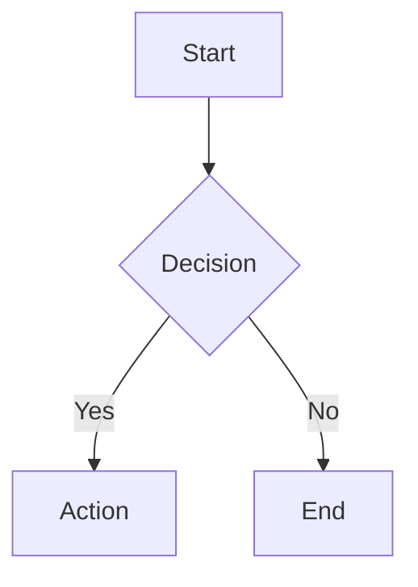

# Working with Documentation

**Announce:** "Using kn-doc to work with documentation."

**Core principle:** SEARCH BEFORE CREATING - avoid duplicates.

## Inputs

- Doc path, topic, folder, or task/spec reference
- Whether this is a create, update, or search request

## Preflight

- Search before creating
- Prefer section edits for targeted changes
- Preserve doc structure and metadata unless the user asked for a restructure
- Validate refs after doc changes

## Quick Reference

```json
// List docs
mcp_knowns_docs({ "action": "list" })

// View doc (smart mode)
mcp_knowns_docs({ "action": "get", "path": "<path>", "smart": true })

// Search docs
mcp_knowns_search({ "action": "search", "query": "<query>", "type": "doc" })

// Create doc (MUST include description)
mcp_knowns_docs({ "action": "create", "title": "<title>",
  "description": "<brief description of what this doc covers>",
  "tags": ["tag1", "tag2"],
  "folder": "folder"
})

// Update content
mcp_knowns_docs({ "action": "update", "path": "<path>",
  "content": "content"
})

// Update metadata (title, description, tags)
mcp_knowns_docs({ "action": "update", "path": "<path>",
  "title": "New Title",
  "description": "Updated description",
  "tags": ["new", "tags"]
})

// Update section only
mcp_knowns_docs({ "action": "update", "path": "<path>",
  "section": "2",
  "content": "## 2. New Content\n\n..."
})
```

## Creating Documents

1. Search first (avoid duplicates)
2. Choose location:

| Type | Folder |
|------|--------|
| Core | (root) |
| Guide | `guides` |
| Pattern | `patterns` |
| API | `api` |

3. Create with **title + description + tags**
4. Add content
5. **Validate** after creating

**CRITICAL:** Always include `description` - validate will fail without it!

## Updating Documents

**Section edit is most efficient:**
```json
mcp_knowns_docs({ "action": "update", "path": "<path>",
  "section": "3",
  "content": "## 3. New Content\n\n..."
})
```

## Validate After Changes

**CRITICAL:** After creating/updating docs, validate:

```json
// Validate specific doc (saves tokens)
mcp_knowns_validate({ "entity": "<doc-path>" })

// Or validate all docs
mcp_knowns_validate({ "scope": "docs" })
```

If errors found, fix before continuing.

## Shared Output Contract

All built-in skills in scope must end with the same user-facing information order: `kn-init`, `kn-spec`, `kn-plan`, `kn-research`, `kn-implement`, `kn-verify`, `kn-doc`, `kn-template`, `kn-extract`, and `kn-commit`.

Required order for the final user-facing response:

1. Goal/result - state what doc was created, updated, inspected, or ruled out.
2. Key details - include the most important supporting context, refs, path, warnings, or validation.
3. Next action - recommend a concrete follow-up command only when a natural handoff exists.

Keep this concise for CLI use. Documentation-specific content may extend the key-details section, but must not replace or reorder the shared structure.

Out of scope: explaining, syncing, or generating `.claude/skills/*`. Runtime auto-sync already handles platform copies, so this skill source only defines the built-in output contract.

For `kn-doc`, the key details should cover:

- whether the doc was created, updated, or only inspected
- the canonical doc path
- any important refs added or fixed
- validation result

When doc work naturally leads to another action, include the best next command. If the request ends with inspection or a fully validated update, do not force a handoff.

## Mermaid Diagrams

WebUI supports mermaid rendering. Use for:
- Architecture diagrams
- Flowcharts
- Sequence diagrams
- Entity relationships

````markdown

````

Diagrams render automatically in WebUI preview.

## Checklist

- [ ] Searched for existing docs
- [ ] Created with **description** (required!)
- [ ] Used section editing for updates
- [ ] Used mermaid for complex flows (optional)
- [ ] Referenced with `@doc/<path>`
- [ ] **Validated after changes**

## Red Flags

- Creating near-duplicate docs instead of updating an existing one
- Replacing a full doc when only one section needed a change
- Leaving broken refs after an edit
