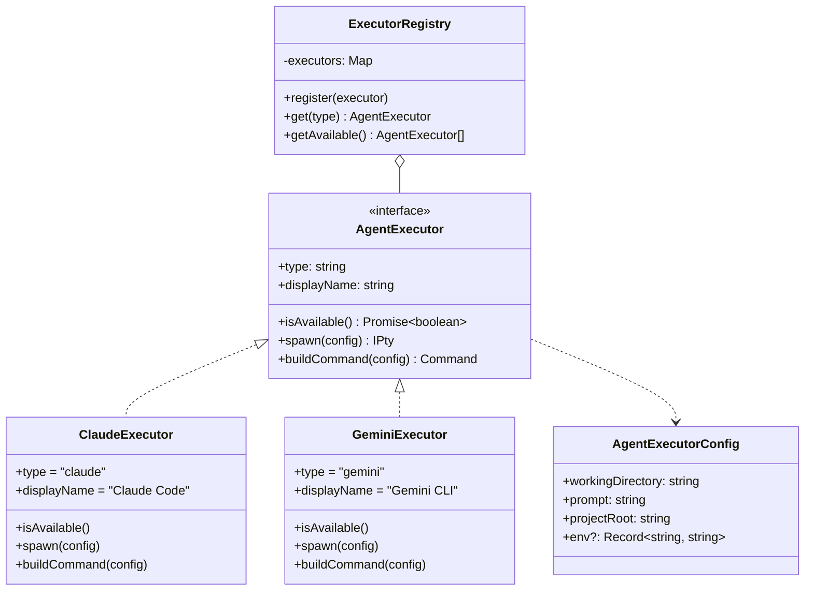

## Overview

The Agent Executor pattern provides an extensible abstraction for spawning and managing AI coding agents. Each agent CLI (Claude Code, Gemini CLI, etc.) is wrapped in an Executor that implements a common interface, allowing the system to support new agents without modifying core code.

**Related docs:**
- @doc/specs/agent-workspace - Full feature specification
- @doc/features/workspace-system - Process manager and worktree architecture

---

## Pattern Structure



---

## Interface

```typescript
// src/server/workspace/executors/base.ts

import type { IPty } from "node-pty";

export interface AgentExecutorConfig {
  workingDirectory: string;   // Worktree path
  prompt: string;             // Instruction for agent
  projectRoot: string;        // Original project root
  env?: Record<string, string>;
}

export interface AgentExecutor {
  /** Unique agent type identifier */
  readonly type: string;

  /** Human-readable name */
  readonly displayName: string;

  /** Check if agent CLI is installed */
  isAvailable(): Promise<boolean>;

  /** Spawn agent process in PTY */
  spawn(config: AgentExecutorConfig): IPty;

  /** Build CLI command + args */
  buildCommand(config: AgentExecutorConfig): {
    command: string;
    args: string[];
  };
}
```

---

## Built-in Executors

### Claude Code

```typescript
// src/server/workspace/executors/claude.ts

export class ClaudeExecutor implements AgentExecutor {
  readonly type = "claude";
  readonly displayName = "Claude Code";

  async isAvailable(): Promise<boolean> {
    // spawnSync("claude", ["--version"])
    // return status === 0
  }

  buildCommand(config: AgentExecutorConfig) {
    return {
      command: "claude",
      args: ["--print", config.prompt],
    };
  }

  spawn(config: AgentExecutorConfig): IPty {
    const { command, args } = this.buildCommand(config);
    return pty.spawn(command, args, {
      name: "xterm-256color",
      cols: 120,
      rows: 30,
      cwd: config.workingDirectory,
      env: { ...process.env, ...config.env },
    });
  }
}
```

### Gemini CLI

```typescript
// src/server/workspace/executors/gemini.ts

export class GeminiExecutor implements AgentExecutor {
  readonly type = "gemini";
  readonly displayName = "Gemini CLI";

  async isAvailable(): Promise<boolean> {
    // spawnSync("gemini", ["--version"])
  }

  buildCommand(config: AgentExecutorConfig) {
    return {
      command: "gemini",
      args: ["-p", config.prompt],
    };
  }

  spawn(config: AgentExecutorConfig): IPty {
    // Same pattern as ClaudeExecutor
  }
}
```

---

## Executor Registry

```typescript
// src/server/workspace/executors/registry.ts

const executors: Map<string, AgentExecutor> = new Map();

// Register built-in executors at module load
executors.set("claude", new ClaudeExecutor());
executors.set("gemini", new GeminiExecutor());

export function getExecutor(type: string): AgentExecutor | undefined {
  return executors.get(type);
}

export function registerExecutor(executor: AgentExecutor): void {
  executors.set(executor.type, executor);
}

export async function getAvailableAgents(): Promise<Array<{
  type: string;
  displayName: string;
  available: boolean;
}>> {
  const results = [];
  for (const executor of executors.values()) {
    results.push({
      type: executor.type,
      displayName: executor.displayName,
      available: await executor.isAvailable(),
    });
  }
  return results;
}
```

---

## Adding a New Agent

To add support for a new AI agent (e.g., Cursor Agent CLI):

1. Create `src/server/workspace/executors/cursor.ts`:

```typescript
export class CursorExecutor implements AgentExecutor {
  readonly type = "cursor";
  readonly displayName = "Cursor Agent";

  async isAvailable() {
    return spawnSync("cursor", ["--version"]).status === 0;
  }

  buildCommand(config: AgentExecutorConfig) {
    return {
      command: "cursor",
      args: ["agent", "--prompt", config.prompt],
    };
  }

  spawn(config: AgentExecutorConfig): IPty {
    const { command, args } = this.buildCommand(config);
    return pty.spawn(command, args, {
      name: "xterm-256color",
      cols: 120, rows: 30,
      cwd: config.workingDirectory,
      env: { ...process.env, ...config.env },
    });
  }
}
```

2. Register in `registry.ts`:

```typescript
import { CursorExecutor } from "./cursor";
executors.set("cursor", new CursorExecutor());
```

3. Add `"cursor"` to `AgentType` union in `src/models/workspace.ts`

That's it. No changes to ProcessManager, routes, or UI needed.

---

## Why node-pty

| Approach | Colors | Cursor | Interactive | Agent behavior |
|----------|--------|--------|-------------|----------------|
| `child_process.spawn` | Lost | Lost | No | Degraded (no TTY) |
| `child_process.spawn` + `--output-format stream-json` | No | No | No | Text only |
| **`node-pty`** | **Full ANSI** | **Full** | **Yes** | **Identical to terminal** |

AI agent CLIs detect TTY and adjust their output (progress bars, colors, interactive prompts). `node-pty` allocates a real pseudo-terminal so agents behave exactly as they would in a user's terminal.

---

## File Locations

```
src/server/workspace/executors/
├── base.ts        # AgentExecutor interface + AgentExecutorConfig
├── claude.ts      # Claude Code executor
├── gemini.ts      # Gemini CLI executor
└── registry.ts    # Executor registry (register + lookup)
```


---

## OpenCode Server API Executor

The OpenCode agent supports two execution modes:

1. **CLI Mode** (default): Spawns `opencode run` per request
2. **API Mode**: Uses OpenCode's built-in server for better performance and features

### Why API Mode?

| Feature | CLI Mode | API Mode |
|---------|----------|----------|
| Process spawn overhead | Per request | Once (server) |
| Session persistence | None (ephemeral) | Full CRUD |
| Forking | Not supported | `POST /session/:id/fork` |
| Async prompts | Blocking only | `POST /session/:id/prompt_async` |
| Error handling | Exit codes | HTTP status codes |

### Configuration

Set in `.knowns/config.json`:

```json
{
  "settings": {
    "opencodeServer": {
      "host": "127.0.0.1",
      "port": 4096,
      "password": "optional"
    }
  }
}
```

Or via CLI:
```bash
knowns config set settings.opencodeServer.host 127.0.0.1
knowns config set settings.opencodeServer.port 4096
knowns config set settings.opencodeServer.password yourpassword
```

### Starting the OpenCode Server

```bash
# Start server (default port 4096)
opencode serve

# Custom port
opencode serve --port 5000

# With authentication
OPENCODE_SERVER_PASSWORD=secret opencode serve
```

### Implementation

The OpenCode client is implemented in Go:

- `internal/agents/opencode/client.go` - HTTP client with session management
- `internal/agents/opencode/events.go` - Event normalization for API responses
- `internal/server/workspace/process.go` - ProcessManager integration

### API Reference

| Endpoint | Method | Description |
|----------|--------|-------------|
| `/global/health` | GET | Server health check |
| `/session` | GET | List all sessions |
| `/session` | POST | Create new session |
| `/session/:id` | GET | Get session details |
| `/session/:id` | DELETE | Delete session |
| `/session/:id/fork` | POST | Fork session |
| `/session/:id/message` | POST | Send message (sync) |
| `/session/:id/prompt_async` | POST | Send message (async) |
| `/session/:id/event` | WS | WebSocket event stream |

### Auto-Fallback

If the OpenCode server is not available, the system automatically falls back to CLI mode. No configuration changes required for the fallback.
