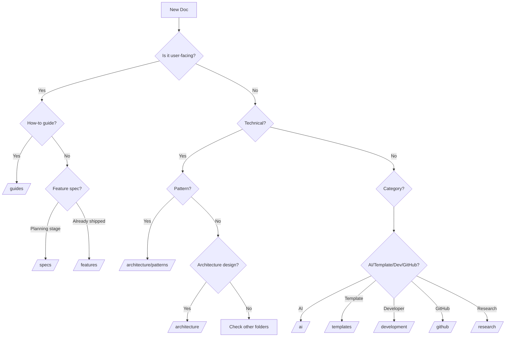

# Documentation Organization

## Overview

This document defines the folder structure and grouping conventions for Knowns documentation system.

---

## Folder Structure

```
📁 .knowns/docs/
├── 📄 readme.md                    # Project overview / Hub specification
│
├── 📁 guides/                      # User-facing documentation (11 docs)
├── 📁 specs/                       # Feature specifications (11 docs)
├── 📁 features/                    # Implemented feature docs (10 docs)
├── 📁 architecture/                # Technical architecture
│   ├── overview.md
│   └── 📁 patterns/                # All patterns (22 docs)
├── 📁 templates/                   # Template system docs (5 docs)
├── 📁 ai/                          # AI integration (6 docs)
├── 📁 development/                 # Developer documentation
│   ├── developer-guide.md
│   ├── workflow.md
│   ├── release-process.md
│   └── 📁 conventions/             # This doc + others
├── 📁 github/                      # GitHub configuration (2 docs)
└── 📁 research/                    # Temporary research & investigations
    └── 📁 bug-reports/
```

---

## Grouping Rules

| Folder | Purpose | What Goes Here | Examples |
|--------|---------|----------------|----------|
| **`/guides/`** | User-facing how-to documentation | End-user guides, tutorials, references | CLI Guide, User Guide, MCP Integration Guide, Semantic Search Guide |
| **`/specs/`** | Feature specifications (planning/design stage) | Future features being planned, SDD specs | Agent Workspace, Chat UI, SDD, Semantic Search |
| **`/features/`** | Implemented feature documentation | Feature docs for shipped functionality | Time Tracking, Import System, Workspace System, Git Modes, Init Process |
| **`/architecture/patterns/`** | Technical & domain patterns | Reusable patterns (tech + business) | Command Pattern, Storage Pattern, MCP Server, Auth Patterns, UI Patterns |
| **`/templates/`** | Template system documentation | Template config, examples, usage | Template Overview, Config, Examples, Import |
| **`/ai/`** | AI integration documentation | MCP, skills, platforms, agent tips | MCP Config, Skills System, Platforms, Agent Quick Ref |
| **`/development/`** | Developer documentation | Contributing, workflow, release process | Developer Guide, Workflow, Release Process, Conventions |
| **`/github/`** | GitHub configuration | Bots, CI/CD, branch protection | Bots Setup, Branch Protection |
| **`/research/`** | Temporary research & investigations | Draft research, bug reports, explorations | UI Features Investigation, Bug Reports |

---

## Decision Tree

### Where should I put a new doc?



---

## Examples

### ✅ Correct Placement

| Doc | Folder | Reason |
|-----|--------|--------|
| "How to use CLI" | `/guides/cli-guide.md` | User-facing tutorial |
| "Semantic Search Spec" | `/specs/semantic-search.md` | Future feature (planning) |
| "Time Tracking Feature" | `/features/time-tracking.md` | Shipped feature documentation |
| "Command Pattern" | `/architecture/patterns/command.md` | Technical pattern |
| "Auth Patterns" | `/architecture/patterns/auth-patterns.md` | Domain pattern |
| "MCP Setup Guide" | `/guides/mcp-integration-guide.md` | User guide |
| "Skills System" | `/ai/skills.md` | AI integration feature |
| "Release Process" | `/development/release-process.md` | Developer process |

### ❌ Wrong Placement

| Doc | Wrong Folder | Should Be | Why |
|-----|--------------|-----------|-----|
| "Time Tracking" | `/core/` | `/features/` | No `/core/` folder, use `/features/` |
| "Auth Pattern" | `/patterns/` | `/architecture/patterns/` | All patterns in one place |
| "Git Modes Design" | `/architecture/features/` | `/features/` | Implemented features go to `/features/` |
| "Bug Report" | `/docs/` | `/research/bug-reports/` | Temp files in `/research/` |

---

## Specs vs Features

A common point of confusion:

| | `/specs/` | `/features/` |
|---|-----------|--------------|
| **Status** | Planning / Design | Implemented / Shipped |
| **Audience** | Developers (implementation planning) | Users + Developers (reference) |
| **Content** | Acceptance criteria, design decisions, implementation plan | How it works, API reference, usage examples |
| **Lifecycle** | Created before coding starts | Created after feature ships |
| **Example** | "Agent Workspace Spec" (planning phase) | "Workspace System" (after shipping) |

**Rule of thumb:** If you're writing it BEFORE implementation → `/specs/`. If AFTER implementation → `/features/`.

---

## Migration History

### 2026-03-19: Documentation Reorganization

**Moved files:**

1. **Pattern files (3):**
   - `patterns/auth-patterns.md` → `architecture/patterns/auth-patterns.md`
   - `patterns/pattern-drag-resize-panel.md` → `architecture/patterns/pattern-drag-resize-panel.md`
   - `patterns/pattern-self-contained-action-dialog.md` → `architecture/patterns/pattern-self-contained-action-dialog.md`

2. **Feature files (7):**
   - `architecture/features/git-modes.md` → `features/git-modes.md`
   - `architecture/features/global-task-modal.md` → `features/global-task-modal.md`
   - `architecture/features/id-strategy.md` → `features/id-strategy.md`
   - `architecture/features/init-process.md` → `features/init-process.md`
   - `architecture/features/real-time-sync.md` → `features/real-time-sync.md`
   - `architecture/features/workspace-system.md` → `features/workspace-system.md`
   - `core/time-tracking.md` → `features/time-tracking.md`

3. **Spec file (1):**
   - `specschat-ui-revert-copy.md` → `specs/chat-ui-revert-copy.md`

4. **Research files (2):**
   - `docs/docs/research-ui-features-investigation.md` → `research/ui-features-investigation.md`
   - `docs/docs/bug-report.md` → `research/bug-reports/variant-selection-e2e.md`

**Removed folders:**
- `/patterns/` - merged into `/architecture/patterns/`
- `/architecture/features/` - moved to `/features/`
- `/core/` - moved to `/features/`
- `/docs/docs/` - moved to `/research/`
- `/tests/` - was empty

**Updated references (4):**
- Fixed `@doc/architecture/features/*` → `@doc/features/*` across 4 files

---

## Maintenance

### When to review structure?

- Every quarter, check for:
  - Orphaned files (no references)
  - Duplicated content
  - Outdated information
  - Misplaced files

### Validation

Run validation to check for broken references:

```bash
knowns validate --scope docs --plain
```

---

## Related

- @doc/development/developer-guide - Overall developer documentation
- @doc/guides/reference-system-guide - How to use @doc/ references
