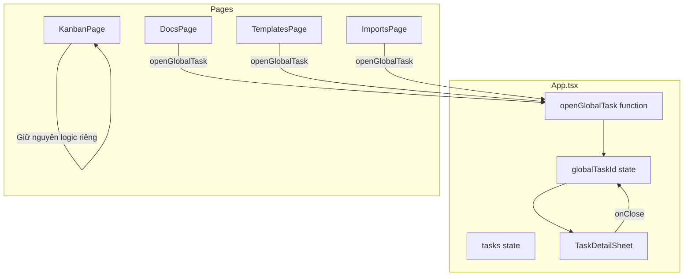

## Problem

Hiện tại khi click vào task link trong DocsPage (hoặc các page khác), user bị chuyển sang KanbanPage:

```
DocsPage → click task link → window.location.hash = '/kanban/{taskId}'
         → Mất context của doc đang xem
         → Đóng modal → về /kanban, không phải /docs
```

**User expectation:** Mở task detail overlay ngay trên page hiện tại, đóng xong vẫn ở page cũ.

---

## Solution: Global Task Modal

Lift `TaskDetailSheet` lên App level để có thể mở từ bất kỳ page nào.

### Architecture



### State Design

```typescript
// App.tsx
const [globalTaskId, setGlobalTaskId] = useState<string | null>(null);

const openGlobalTask = (taskId: string) => {
  setGlobalTaskId(taskId);
};

const closeGlobalTask = () => {
  setGlobalTaskId(null);
  // KHÔNG đổi window.location.hash
};

const globalTask = globalTaskId 
  ? tasks.find(t => t.id === globalTaskId) 
  : null;
```

### Context API

```typescript
// contexts/GlobalTaskContext.tsx
interface GlobalTaskContextType {
  openTask: (taskId: string) => void;
  closeTask: () => void;
  currentTaskId: string | null;
}

const GlobalTaskContext = createContext<GlobalTaskContextType>(...);

export const useGlobalTask = () => useContext(GlobalTaskContext);
```

### Usage in Pages

```typescript
// DocsPage.tsx
const { openTask } = useGlobalTask();

// Khi click task link
const handleTaskClick = (taskId: string) => {
  openTask(taskId);  // Mở modal, không đổi route
};
```

---

## Files to Modify

| File | Changes |
|------|---------|
| `src/ui/contexts/GlobalTaskContext.tsx` | **NEW** - Context cho global task modal |
| `src/ui/App.tsx` | Wrap với GlobalTaskProvider, render TaskDetailSheet |
| `src/ui/pages/DocsPage.tsx` | Sử dụng `useGlobalTask()` thay vì đổi route |
| `src/ui/components/organisms/Board.tsx` | Giữ nguyên - KanbanPage vẫn dùng URL-based |

---

## Behavior Comparison

| Action | Before | After |
|--------|--------|-------|
| Click task in DocsPage | Navigate to `/kanban/{id}` | Open modal overlay |
| Close modal from DocsPage | Navigate to `/kanban` | Stay on `/docs` |
| Click task in KanbanPage | Open modal (URL-based) | Same (unchanged) |
| Close modal from KanbanPage | Navigate to `/kanban` | Same (unchanged) |

---

## Edge Cases

### 1. Task không tồn tại
```typescript
const globalTask = globalTaskId 
  ? tasks.find(t => t.id === globalTaskId) 
  : null;

// Nếu không tìm thấy → không render modal
// Có thể show toast error
```

### 2. Task được update/delete
- SSE event `tasks:updated` đã update `tasks` state ở App level
- Modal tự động reflect changes
- Nếu task bị delete → close modal

### 3. Keyboard shortcut
- `Esc` key → close modal (đã có trong TaskDetailSheet)

---

## Related

- @doc/guides/web-ui-guide - Web UI keyboard shortcuts
- @doc/architecture/patterns/ui - React UI Pattern
