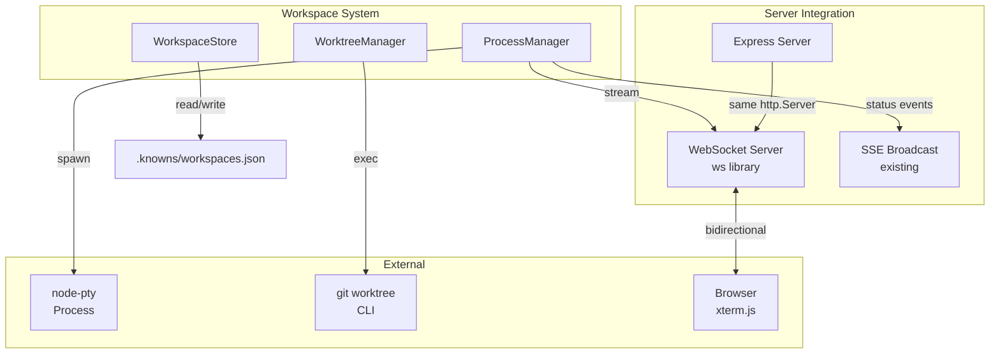
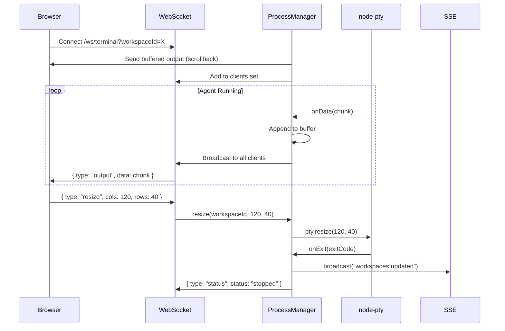
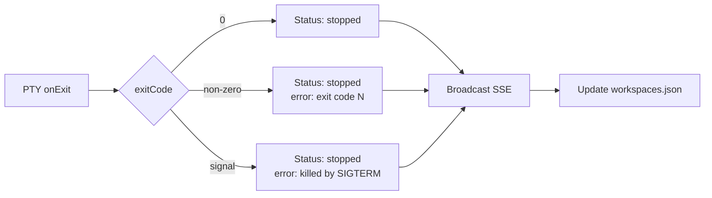

## Overview

The Workspace System consists of three core components that work together to manage AI agent lifecycle: **ProcessManager** (PTY orchestration), **WorktreeManager** (git isolation), and **WebSocket Server** (terminal streaming).

**Related docs:**
- @doc/specs/agent-workspace - Full feature specification
- @doc/architecture/patterns/agent-executor-pattern - Executor pattern

---

## Component Architecture



---

## 1. Process Manager

**File:** `src/server/workspace/process-manager.ts`

Orchestrates PTY processes and WebSocket client connections.

### Internal State

```typescript
interface ManagedProcess {
  workspace: Workspace;
  pty: IPty;                    // node-pty handle
  clients: Set<WebSocket>;     // Connected browser viewers
  outputBuffer: string[];      // Scrollback (max 5000 lines)
}

class ProcessManager {
  private processes: Map<string, ManagedProcess> = new Map();
}
```

### Methods

| Method | Description |
|--------|-------------|
| `start(workspace, prompt)` | Spawn PTY via executor, wire data/exit handlers |
| `stop(workspaceId)` | SIGTERM → wait 5s → SIGKILL if alive |
| `attach(workspaceId, ws)` | Send buffer first, add to client set |
| `detach(workspaceId, ws)` | Remove from client set |
| `resize(workspaceId, cols, rows)` | Forward resize to PTY |
| `write(workspaceId, data)` | Forward keyboard input to PTY |
| `getStatus(workspaceId)` | Return running/pid/exitCode |
| `shutdownAll()` | Stop all processes on server shutdown |

### Data Flow



### Output Buffer

The buffer stores the last 5000 lines of terminal output. When a new browser client connects (or reconnects), the full buffer is sent first so the user sees the complete history.

```typescript
attach(workspaceId: string, ws: WebSocket): void {
  const proc = this.processes.get(workspaceId);
  if (!proc) return;

  // Send scrollback buffer
  ws.send(JSON.stringify({
    type: "buffer",
    data: proc.outputBuffer,
  }));

  // Add to live clients
  proc.clients.add(ws);
}
```

---

## 2. Git Worktree Manager

**File:** `src/server/workspace/worktree-manager.ts`

Manages git worktree lifecycle for workspace isolation.

### How Worktrees Work

```
project/                          # Main working tree
├── .knowns/
│   ├── worktrees/                # Workspace worktrees (gitignored)
│   │   ├── ws-a1b2c3/           # Worktree for workspace a1b2c3
│   │   │   ├── src/             # Full project copy
│   │   │   └── ...
│   │   └── ws-d4e5f6/           # Another workspace
│   └── workspaces.json          # Workspace metadata
└── src/                          # Main project source
```

Each worktree is a **linked copy** sharing the same `.git` directory but with an independent checkout. This means:
- Changes in one worktree don't affect others
- No `git stash` or branch switching needed
- Multiple agents can work simultaneously
- Low disk overhead (only changed files differ)

### Methods

| Method | Git Command | Description |
|--------|-------------|-------------|
| `create(workspaceId)` | `git worktree add -b knowns/ws-{id} .knowns/worktrees/{id} HEAD` | Create worktree + branch from HEAD |
| `remove(workspaceId)` | `git worktree remove --force` + `git branch -D` | Remove worktree + delete branch |
| `list()` | `git worktree list --porcelain` | List active worktrees |
| `isGitRepo()` | `git rev-parse --is-inside-work-tree` | Check if in git repo |
| `getHead()` | `git rev-parse HEAD` | Current commit hash |

### Branch Naming

Branches use namespace prefix `knowns/ws-{id}` to avoid collision with user branches:

```
main
develop
feat/my-feature
knowns/ws-a1b2c3     ← workspace branch
knowns/ws-d4e5f6     ← workspace branch
```

### Cleanup

On workspace deletion:
1. Stop agent process if running
2. `git worktree remove .knowns/worktrees/{id} --force`
3. `git branch -D knowns/ws-{id}`
4. Remove workspace record from `workspaces.json`

On server startup:
- Scan `workspaces.json` for workspaces with status "running"
- Mark them as "stopped" (process died with server)
- Optionally prune orphaned worktrees: `git worktree prune`

---

## 3. WebSocket Server

**Integration with existing Express server** in `src/server/index.ts`

### Setup

```typescript
import { WebSocketServer } from "ws";

// After app.listen():
const server = app.listen(port);

const wss = new WebSocketServer({
  server,              // Share same HTTP server
  path: "/ws/terminal" // Only handle this path
});
```

The WebSocket server runs on the **same port** as Express. The `ws` library upgrades HTTP connections on `/ws/terminal` to WebSocket, leaving all other paths for Express.

### Connection Flow

```mermaid
sequenceDiagram
    participant B as Browser (xterm.js)
    participant WSS as WebSocket Server
    participant PM as ProcessManager

    B->>WSS: WS connect /ws/terminal?workspaceId=abc
    WSS->>WSS: Parse workspaceId from URL
    WSS->>PM: attach("abc", ws)
    PM->>B: { type: "buffer", data: [...scrollback] }

    loop Terminal Session
        PM->>B: { type: "output", data: "..." }
        B->>PM: { type: "resize", cols: 120, rows: 40 }
        B->>PM: { type: "input", data: "y
" }
    end

    B->>WSS: WS close
    WSS->>PM: detach("abc", ws)
```

### Message Protocol

```typescript
// Server → Client
type ServerMessage =
  | { type: "output"; data: string }       // Terminal output chunk
  | { type: "buffer"; data: string[] }     // Initial scrollback
  | { type: "status"; status: WorkspaceStatus; exitCode?: number }

// Client → Server
type ClientMessage =
  | { type: "resize"; cols: number; rows: number }
  | { type: "input"; data: string }        // Keyboard input to PTY
```

### Why WebSocket (not SSE) for Terminal

| Requirement | SSE | WebSocket |
|-------------|-----|-----------|
| Server → Client streaming | Yes | Yes |
| Client → Server (resize, input) | No (need separate POST) | **Yes** |
| Binary-safe data | No | **Yes** |
| High-frequency updates | Adequate | **Better** |
| Multiple channels | Need parsing | **Native** |

Terminal streaming needs bidirectional communication (resize, keyboard input) and high-frequency binary data, which WebSocket handles natively.

---

## 4. Workspace Store

**File:** `src/server/workspace/workspace-store.ts`

Simple JSON file persistence following the time tracking pattern.

```typescript
class WorkspaceStore {
  private filePath: string; // .knowns/workspaces.json

  async getAll(): Promise<Workspace[]>;
  async get(id: string): Promise<Workspace | null>;
  async create(data: CreateWorkspaceInput): Promise<Workspace>;
  async update(id: string, updates: Partial<Workspace>): Promise<Workspace>;
  async delete(id: string): Promise<void>;
}
```

**Why JSON, not Markdown:**
- Workspaces are ephemeral session data
- No need for version history or frontmatter
- Faster read/write for frequent status updates
- Same pattern as `time.json` and `time-entries.json`

---

## Error Handling

### Agent Crash



### Server Restart

1. Read `workspaces.json`
2. Find workspaces with `status: "running"`
3. Set `status: "stopped"`, `error: "Server restarted"`
4. Run `git worktree prune` to clean orphans

### WebSocket Reconnection

Browser-side (`useTerminalWebSocket` hook):
- Detect disconnect
- Exponential backoff: 1s, 2s, 4s, 8s (max 30s)
- On reconnect: re-attach to ProcessManager, receive buffer

---

## File Locations

```
src/server/workspace/
├── process-manager.ts       # PTY orchestration + client tracking
├── worktree-manager.ts      # Git worktree lifecycle
├── workspace-store.ts       # JSON persistence
├── executors/               # Agent executor implementations
│   ├── base.ts
│   ├── claude.ts
│   ├── gemini.ts
│   └── registry.ts
└── index.ts                 # Barrel exports
```
