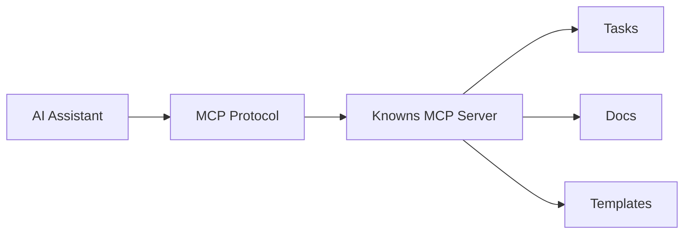
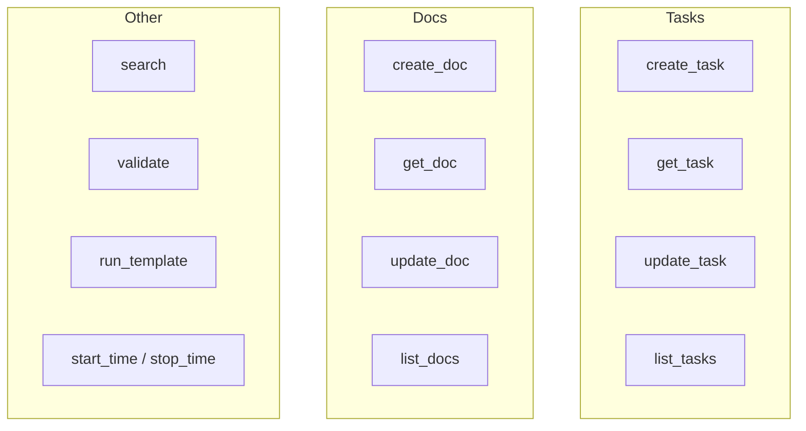

# MCP Integration Guide

Setup Knowns MCP server for AI assistants. Full docs: `./docs/mcp-integration.md`

## Architecture



## Quick Setup

Knowns is a compiled Go binary. Install it first, then configure MCP.

### Installation

```bash
# Via npm (downloads platform-specific Go binary)
npm install -g knowns

# Via Go
go install github.com/howznguyen/knowns/cmd/knowns@latest

# Via curl (Linux/macOS)
curl -fsSL https://raw.githubusercontent.com/howznguyen/knowns/main/install/install.sh | sh
```

### Claude Desktop

Add to `~/Library/Application Support/Claude/claude_desktop_config.json`:

```json
{
  "mcpServers": {
    "knowns": {
      "command": "knowns",
      "args": ["mcp"]
    }
  }
}
```

### Cursor

Add to `.cursor/mcp.json`:

```json
{
  "mcpServers": {
    "knowns": {
      "command": "knowns",
      "args": ["mcp"]
    }
  }
}
```

### Project-Specific (.mcp.json)

Create `.mcp.json` in project root:

```json
{
  "mcpServers": {
    "knowns": {
      "command": "knowns",
      "args": ["mcp"]
    }
  }
}
```

> **Note**: If you don't have `knowns` installed globally, you can use `npx -y knowns mcp` as the command instead.
## Available MCP Tools



### Task Tools
- `create_task` - Create new task
- `get_task` - Get task by ID
- `update_task` - Update task fields
- `list_tasks` - List with filters

### Doc Tools
- `create_doc` - Create document
- `get_doc` - Get doc (supports smart, section, toc)
- `update_doc` - Update doc/section
- `list_docs` - List with filters

### Search & Other Tools
- `search` - Unified search (tasks + docs) with semantic support
- `validate` - Check broken refs
- `list_templates` / `run_template` - Templates
- `start_time` / `stop_time` - Time tracking
- `get_board` - Kanban board state

## Session Init

AI agents should start with:

```json
mcp__knowns__detect_projects({})
mcp__knowns__set_project({ "projectRoot": "/path/to/project" })
```

## Tips

1. Use `smart: true` for docs (auto-handles large files)
2. Follow refs returned in task/doc content
3. Validate after making changes
4. Use section editing for large docs
