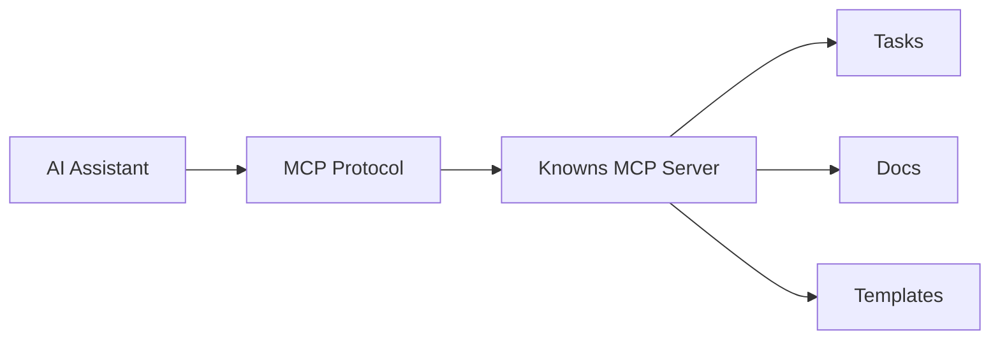
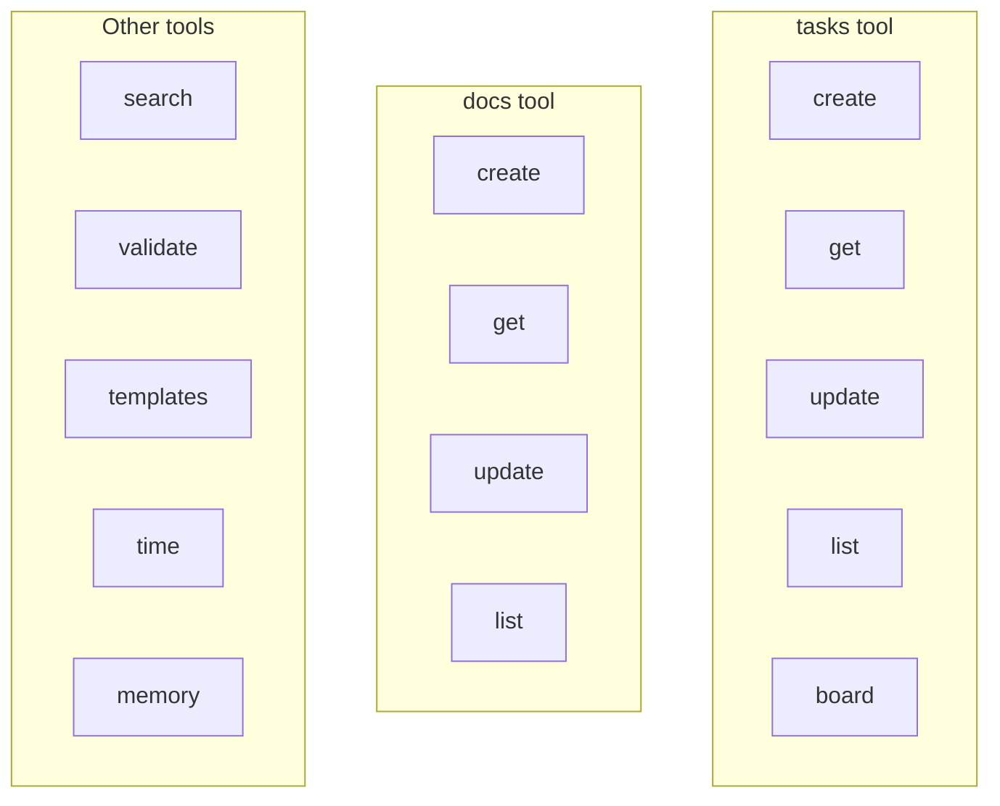

# MCP Integration Guide

Setup Knowns MCP server for AI assistants. Full docs: `./docs/mcp-integration.md`

## Architecture



## Quick Setup

Knowns is a compiled Go binary. Install it first, then configure MCP.

### Installation

```bash
# Via npm (downloads platform-specific Go binary)
npm install -g knowns

# Via Go
go install github.com/howznguyen/knowns/cmd/knowns@latest

# Via curl (Linux/macOS)
curl -fsSL https://raw.githubusercontent.com/howznguyen/knowns/main/install/install.sh | sh
```

### Claude Desktop

Add to `~/Library/Application Support/Claude/claude_desktop_config.json`:

```json
{
  "mcpServers": {
    "knowns": {
      "command": "knowns",
      "args": ["mcp"]
    }
  }
}
```

### Cursor

Add to `.cursor/mcp.json`:

```json
{
  "mcpServers": {
    "knowns": {
      "command": "knowns",
      "args": ["mcp"]
    }
  }
}
```

### Project-Specific (.mcp.json)

Create `.mcp.json` in project root:

```json
{
  "mcpServers": {
    "knowns": {
      "command": "knowns",
      "args": ["mcp"]
    }
  }
}
```

> **Note**: If you don't have `knowns` installed globally, you can use `npx -y knowns mcp` as the command instead.
## Available MCP Tools

Tools are grouped by domain. Each tool uses an `action` parameter to dispatch operations.



### Task Tool (`tasks`)
- `create` - Create new task
- `get` - Get task by ID
- `update` - Update task fields (status, AC, plan, notes)
- `list` - List with filters
- `board` - Get kanban board state

### Doc Tool (`docs`)
- `create` - Create document
- `get` - Get doc (supports smart, section, toc)
- `update` - Update doc/section
- `list` - List with filters

### Other Tools
- `search` - Unified search (tasks + docs + memories) with semantic support
- `validate` - Check broken refs
- `templates` - List, get, run, create templates
- `time` - Start, stop, add, report time tracking
- `memory` - Add, get, list, update, delete, promote, demote memories

## Session Init

AI agents should start with:

```json
mcp__knowns__project({ "action": "detect" })
mcp__knowns__project({ "action": "set", "projectRoot": "/path/to/project" })
```

## Tips

1. Use `smart: true` for docs (auto-handles large files)
2. Follow refs returned in task/doc content
3. Validate after making changes
4. Use section editing for large docs
