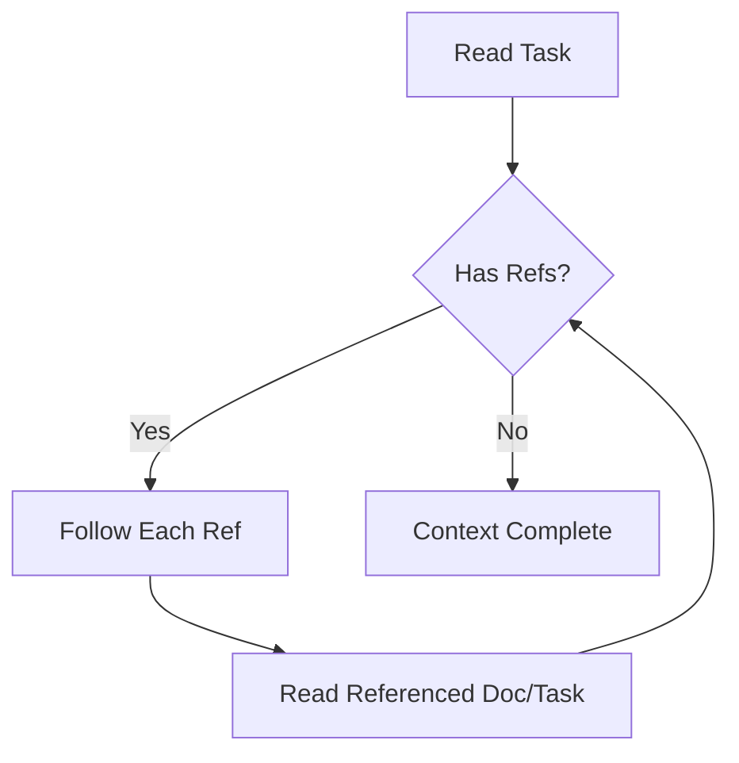

# Reference System Guide

Link tasks and docs using references. Full docs: `./docs/reference-system.md`

## Reference Flow

```mermaid
graph LR
    A[Task] -->|@doc/path| B[Doc]
    A -->|@task-id| C[Other Task]
    B -->|@doc/path| D[Other Doc]
    B -->|@task-id| A
```

## Reference Formats

| Type | Write As | Example |
|------|----------|---------|
| Task | `@task-<id>` | `@task-42` |
| Doc | `@doc/<path>` | `@doc/patterns/auth` |
| Template | `@template/<name>` | `@template/component` |

## Usage

### In Task Descriptions
```markdown
Implement auth following @doc/patterns/auth.
Depends on @task-41.
```

### In Doc Content
```markdown
See @doc/guides/setup for installation.
Related task: @task-42.
```

### In Implementation Plans
```markdown
1. Review @doc/patterns/auth
2. Complete @task-41 first
3. Use @template/api-endpoint
```

## Following Refs (AI Agents)



When you see refs in output:
```
@.knowns/tasks/task-42 - Login Feature.md
@.knowns/docs/patterns/auth.md
```

Follow them:
```bash
knowns task 42 --plain
knowns doc "patterns/auth" --plain
```

## Validation

Check for broken refs:
```bash
knowns validate --plain
```

Output:
```
ERRORS:
  task-42: Broken doc ref: @doc/nonexistent

WARNINGS:
  patterns/auth.md: No tasks reference this doc
```

## Best Practices

1. **Use refs liberally** - Connect related items
2. **Validate often** - Catch broken refs early
3. **Follow recursively** - Refs may contain more refs
4. **Use in plans** - Link to patterns/docs you follow
