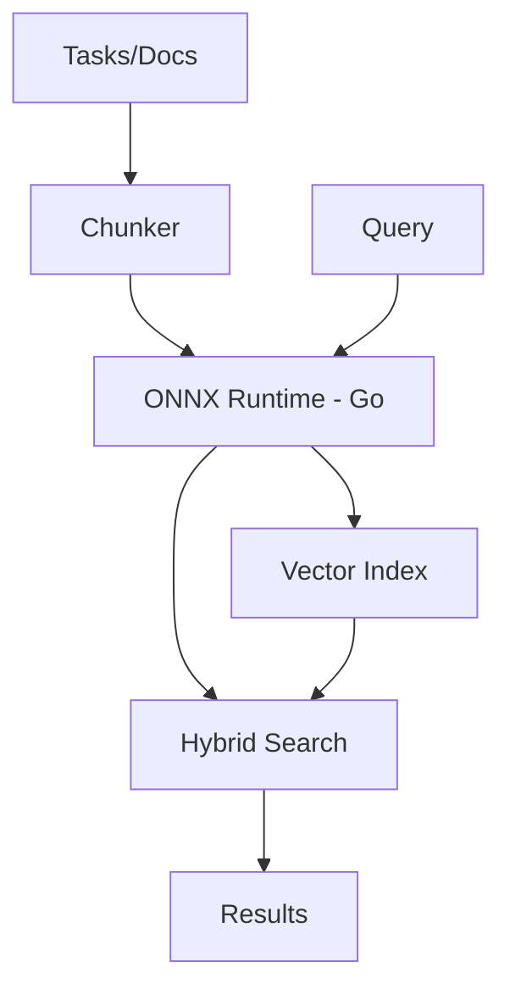
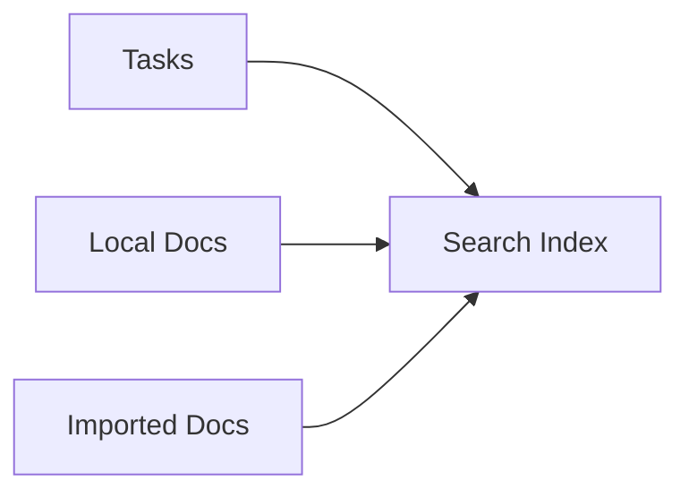

# Semantic Search Guide

Search tasks and docs by **meaning**, not just keywords. Uses local AI models for privacy and offline capability.

## Architecture

Knowns uses ONNX Runtime (via Go bindings) for local embedding inference. No external API calls required.


## Quick Start

```bash
# Enable during init
knowns init my-project
# → "Enable semantic search?" [y/n] → y
# → "Select model:" → gte-small (recommended)

# Or enable on existing project
knowns config set search.semantic.enabled true
knowns model download gte-small
knowns search reindex
```

## Model Management

ONNX models are stored at `~/.knowns/models/` (shared across projects). The Go binary loads models directly via ONNX Runtime -- no Node.js or Python dependencies required.

| Model | Size | Speed | Best For |
|-------|------|-------|----------|
| `gte-small` | 67MB | Fast | Most projects (recommended) |
| `all-MiniLM-L6-v2` | 80MB | Fast | Alternative |
| `gte-base` | 220MB | Medium | Large projects |

```bash
knowns model list              # List downloaded
knowns model download gte-small # Download
knowns model remove gte-small   # Remove
```
## Search Usage

```bash
# Semantic search
knowns search "how to handle auth errors"

# Force keyword only
knowns search "auth error" --keyword

# Filter by type
knowns search "api design" --type doc
knowns search "login bug" --type task
```

## Configuration

In `.knowns/config.json`:

```json
{
  "settings": {
    "semanticSearch": {
      "enabled": true,
      "model": "gte-small"
    }
  }
}
```

## Indexing



Index auto-updates on create/update. Manual rebuild:
```bash
knowns search reindex
```

## Troubleshooting

| Issue | Fix |
|-------|-----|
| Model not found | `knowns model download gte-small` |
| Index stale | `knowns search reindex` |
| Slow first search | Normal - model loads into memory |

> Full docs: `./docs/semantic-search.md`
