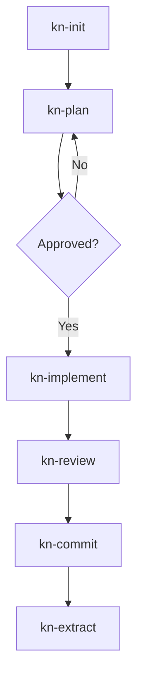
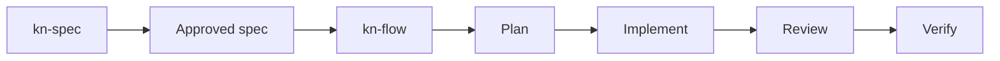

# Skills Guide

Skill commands for AI-assisted workflow. Full docs: `./docs/skills.md`

Skills are separate from MCP tools. MCP tools appear as structured domain APIs such as `tasks`, `docs`, `memory`, `search`, and `code`; skills are workflow commands layered on top.

| Platform | Skill syntax |
|---|---|
| Claude Code | `/kn-spec`, `/kn-flow`, `/kn-review` |
| Codex | `$kn-spec`, `$kn-flow`, `$kn-review` |

## Skill Workflow



## Available Skills

| Skill | Description |
|-------|-------------|
| `kn-init` | Read project docs, understand context |
| `kn-plan <id>` | Take task, gather context, create plan |
| `kn-implement <id>` | Execute plan, track progress |
| `kn-research` | Search codebase, find patterns |
| `kn-review` | Review implemented work |
| `kn-commit` | Create conventional commit |
| `kn-spec` | Create spec document (SDD) |
| `kn-flow @doc/<spec-path>` | Recommended approved-spec orchestration |
| `kn-go <spec-path>` | Legacy no-review-gates approved-spec pipeline |
| `kn-verify` | Run SDD verification |
| `kn-doc` | Create/update documentation |
| `kn-extract` | Extract patterns to docs |
| `kn-template` | Work with templates |

## Typical Session

```text
You: /kn-init
Claude: [Reads README, ARCHITECTURE, task backlog]
        "Project uses React + Express. 5 tasks in-progress..."

You: /kn-plan 42
Claude: [Takes task, reads refs, searches docs]
        "## Implementation Plan
         1. Review @doc/patterns/auth
         2. Create AuthService
         3. Add tests

         Approve?"

You: Yes

You: /kn-implement 42
Claude: [Follows plan, checks ACs progressively]
        "AC1: AuthService created - DONE
         AC2: Tests pass - DONE

         Ready to review?"

You: /kn-review 42
Claude: [Reviews the real diff]
        "Review passed. Ready to commit."

You: /kn-commit
Claude: [Creates conventional commit]
        "feat(auth): add JWT authentication"
```

## SDD Workflow



For complex features:

```text
Claude Code:
/kn-spec user-auth
/kn-flow @doc/specs/user-auth

Codex:
$kn-spec user-auth
$kn-flow @doc/specs/user-auth
```

Use `kn-flow` for normal approved-spec execution. It discovers or generates linked tasks, gates parallel work, runs plan -> implement -> review, and verifies the spec.

If you only want task generation and manual execution:

```text
/kn-plan --from @doc/specs/user-auth
/kn-plan <task-id>
/kn-implement <task-id>
/kn-review <task-id>
/kn-verify
```

Use `kn-go` only when you explicitly want the legacy no-review-gates pipeline.

## Skill Sync

Skills auto-sync when CLI updates. Manual sync:

```bash
knowns sync --skills
```

For initial platform setup:

```bash
knowns setup claude
knowns setup codex
knowns setup opencode
```

## Tips

1. Start with `kn-init` every new session
2. Plan before implement
3. Use `kn-flow` for approved specs or task waves
4. Use `kn-research` when unsure
5. Extract knowledge after completing reusable work
