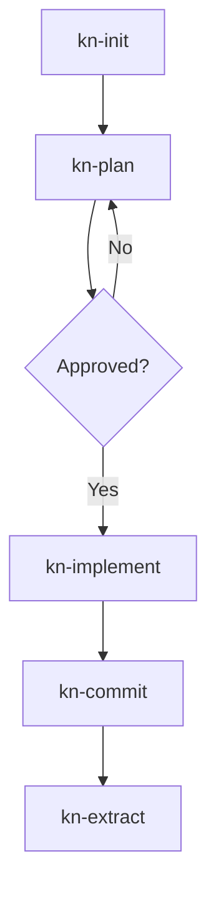
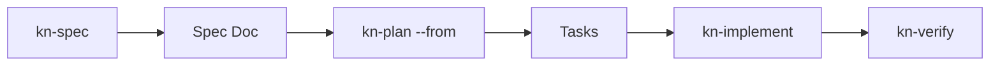

# Skills Guide

Slash commands for AI-assisted workflow. Full docs: `./docs/skills.md`

## Skill Workflow



## Available Skills

| Skill | Description |
|-------|-------------|
| `/kn-init` | Read project docs, understand context |
| `/kn-plan <id>` | Take task, gather context, create plan |
| `/kn-implement <id>` | Execute plan, track progress |
| `/kn-research` | Search codebase, find patterns |
| `/kn-commit` | Create conventional commit |
| `/kn-spec` | Create spec document (SDD) |
| `/kn-verify` | Run SDD verification |
| `/kn-doc` | Create/update documentation |
| `/kn-extract` | Extract patterns to docs |
| `/kn-template` | Work with templates |

## Typical Session

```
You: /kn-init
Claude: [Reads README, ARCHITECTURE, task backlog]
        "Project uses React + Express. 5 tasks in-progress..."

You: /kn-plan 42
Claude: [Takes task, reads refs, searches docs]
        "## Implementation Plan
         1. Review @doc/patterns/auth
         2. Create AuthService
         3. Add tests
         
         Approve?"

You: Yes

You: /kn-implement 42
Claude: [Follows plan, checks ACs progressively]
        "AC1: AuthService created - DONE
         AC2: Tests pass - DONE
         
         Ready to commit?"

You: /kn-commit
Claude: [Creates conventional commit]
        "feat(auth): add JWT authentication"
```

## SDD Workflow



For complex features:

```
/kn-spec user-auth     → Create spec
/kn-plan --from @doc/specs/user-auth  → Generate tasks
/kn-implement <id>     → Implement
/kn-verify             → Check coverage
```

## Skill Sync

Skills auto-sync when CLI updates. Manual sync:

```bash
knowns agents sync
```

## Tips

1. **Start with /kn-init** - Every new session
2. **Plan before implement** - Get approval
3. **Use /kn-research** - When unsure
4. **Extract knowledge** - /kn-extract after completing
