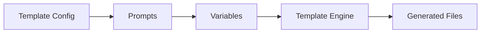

# Templates Guide

Generate code with Handlebars-compatible templates (powered by Go's `text/template` engine).

## Template Flow



The engine accepts Handlebars syntax in `.hbs` files and preprocesses it into Go `text/template` expressions before rendering. Template authors write standard Handlebars; the Go engine handles the translation internally.

## Quick Start

```bash
# List available templates
knowns template list

# Run a template
knowns template run component --name "Button"

# Create new template scaffold
knowns template create my-template
```

## Template Structure

```
.knowns/templates/
└── component/
    ├── _template.yaml        # Config (prompts, actions, metadata)
    ├── {{name}}.go.hbs       # Template file (Handlebars syntax)
    └── {{name}}_test.go.hbs  # Another template file
```

Template files use the `.hbs` extension. The engine strips `.hbs` from output filenames after rendering.

## Config File (`_template.yaml`)

```yaml
name: component
description: Generate a Go service component
destination: internal/services

prompts:
  - name: name
    message: Component name?
    type: text
    validate: required
  - name: withTest
    message: Include tests?
    type: confirm
    initial: true

actions:
  - type: add
    template: "{{snakeCase name}}.go.hbs"
    path: "{{snakeCase name}}.go"
  - type: add
    template: "{{snakeCase name}}_test.go.hbs"
    path: "{{snakeCase name}}_test.go"
    when: "{{withTest}}"
```

## Template Syntax

The engine accepts Handlebars syntax with case-conversion helpers:

```handlebars
{{!-- Comment: does not appear in output --}}

// Package {{snakeCase name}} provides the {{pascalCase name}} service.
package {{snakeCase name}}

{{#if withInterface}}
// {{pascalCase name}} defines the service interface.
type {{pascalCase name}} interface {
    Run() error
}
{{/if}}

// {{pascalCase name}}Impl implements the service.
type {{pascalCase name}}Impl struct {}

func New{{pascalCase name}}() *{{pascalCase name}}Impl {
    return &{{pascalCase name}}Impl{}
}
```

### Available Helpers

| Helper | Input | Output |
|--------|-------|--------|
| `pascalCase` | `my-service` | `MyService` |
| `camelCase` | `my-service` | `myService` |
| `kebabCase` | `MyService` | `my-service` |
| `snakeCase` | `MyService` | `my_service` |
| `upperCase` | `name` | `NAME` |
| `lowerCase` | `NAME` | `name` |
| `startCase` | `myService` | `My Service` |

### Supported Block Helpers

| Syntax | Description |
|--------|-------------|
| `{{#if var}}...{{/if}}` | Conditional block |
| `{{#unless var}}...{{/unless}}` | Negated conditional |
| `{{#each items}}...{{/each}}` | Loop over items |
| `{{#with obj}}...{{/with}}` | Change context |
| `{{!-- comment --}}` | Comment (stripped from output) |

### File Naming

File names also use Handlebars syntax:

```
{{pascalCase name}}.go.hbs         -> UserProfile.go
{{kebabCase name}}-handler.go.hbs  -> user-profile-handler.go
{{snakeCase name}}_test.go.hbs     -> user_profile_test.go
```

The `.hbs` extension is stripped automatically after rendering.

## Import Templates

```bash
# From GitHub
knowns import add shared https://github.com/user/templates

# List imported
knowns template list
# Shows: shared/component, shared/api-endpoint, etc.

# Run imported
knowns template run shared/component --name "Card"
```

## Tips

1. **Use prompts** - Gather variables interactively before generation
2. **Case helpers** - Ensure consistent naming across Go conventions (`PascalCase` for exports, `snakeCase` for files)
3. **Link to docs** - Add `doc: patterns/component` in config for AI context
4. **Share via imports** - Reuse templates across projects
5. **Conditional actions** - Use `when` to skip actions based on prompt values
