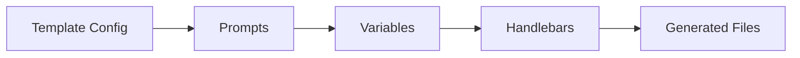
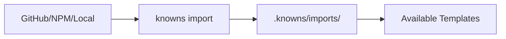

# Templates Guide

Generate code with Handlebars templates. Full docs: `./docs/templates.md`

## Template Flow



## Quick Start

```bash
# List available templates
knowns template list

# Run a template
knowns template run component --name "Button"

# Create new template
knowns template create my-template
```

## Template Structure

```
.knowns/templates/
└── component/
    ├── _template.yaml      # Config
    ├── {{name}}.tsx.hbs    # Template file
    └── {{name}}.test.tsx.hbs
```

## Config File (`_template.yaml`)

```yaml
name: component
description: React component with tests

prompts:
  - name: name
    message: Component name?
    type: input
  - name: type
    message: Component type?
    type: select
    choices: [page, widget, layout]

files:
  - template: "{{name}}.tsx.hbs"
    output: "src/components/{{name}}.tsx"
  - template: "{{name}}.test.tsx.hbs"
    output: "src/components/{{name}}.test.tsx"
```

## Template Syntax

Handlebars with helpers:

```handlebars
// {{pascalCase name}}.tsx
export function {{pascalCase name}}() {
  return <div className="{{kebabCase name}}">
    {{#if hasState}}
    const [state, setState] = useState();
    {{/if}}
  </div>;
}
```

### Available Helpers

| Helper | Input | Output |
|--------|-------|--------|
| `pascalCase` | `my-component` | `MyComponent` |
| `camelCase` | `my-component` | `myComponent` |
| `kebabCase` | `MyComponent` | `my-component` |
| `snakeCase` | `MyComponent` | `my_component` |
| `upperCase` | `name` | `NAME` |
| `lowerCase` | `NAME` | `name` |

## Import Templates



```bash
# From GitHub
knowns import add shared https://github.com/user/templates

# List imported
knowns template list
# Shows: shared/component, shared/api-endpoint, etc.

# Run imported
knowns template run shared/component --name "Card"
```

## Tips

1. **Use prompts** - Interactive variables
2. **Case helpers** - Consistent naming
3. **Link to docs** - Add `doc: patterns/component` in config
4. **Share via imports** - Reuse across projects
