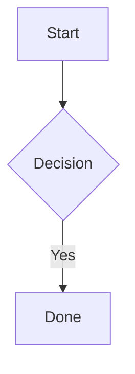

# Web UI Guide

Visual interface for tasks and docs. Full docs: `./docs/web-ui.md`

## Launch

```bash
knowns browser
# Opens http://localhost:6420
```

With custom port:
```bash
knowns browser --port 8080
```

## Features

### Kanban Board (`/kanban`)
- Drag-drop tasks between columns
- Click task to view/edit details
- Filter by label, assignee, priority
- Real-time sync with CLI

### Doc Browser (`/docs`)
- Browse documentation tree
- Markdown preview with mermaid diagrams
- Edit docs inline
- Create new docs

### Dashboard (`/`)
- Task summary by status
- Recent activity
- Quick actions

## Keyboard Shortcuts

| Key | Action |
|-----|--------|
| `n` | New task |
| `/` | Search |
| `Esc` | Close modal |

## Real-time Sync

Web UI syncs automatically when:
- CLI creates/updates tasks
- CLI creates/updates docs
- Another browser tab makes changes

Uses Server-Sent Events (SSE) for instant updates.

## Mermaid Diagrams

Docs support mermaid rendering:

````markdown

````

## Tips

1. **Use alongside CLI** - Both stay in sync
2. **Kanban for overview** - See all tasks at once
3. **Doc browser for reading** - Better than terminal
4. **Keep browser open** - Real-time updates


### Task Lifecycle workflows

Project settings expose Task Lifecycle retention and AI-visibility controls. Task details and list/board views show active, done, and archived metadata. Archive, restore, and batch operations preview eligible/skipped items and warnings before confirmation; Hard Delete appears only when the server grants the trusted capability.

Archived and All views explicitly load historical Tasks and refresh from lifecycle SSE events. See @doc/features/task-lifecycle.
