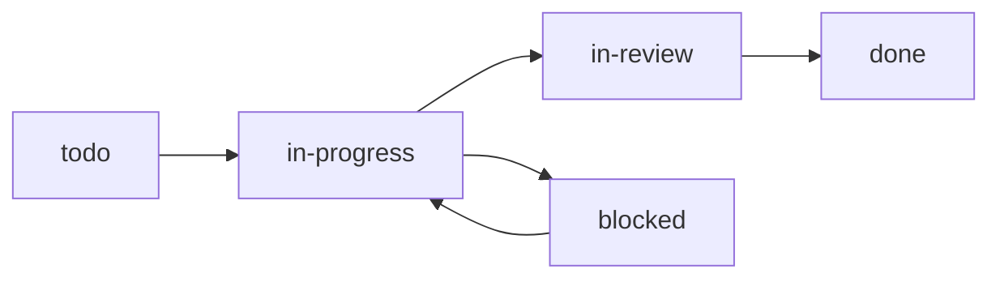
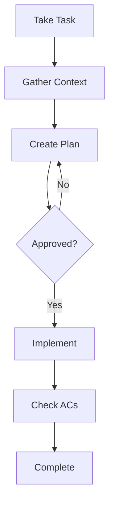

# Workflow Guide

Task lifecycle from creation to completion. Full docs: `./docs/workflow.md`

## Task Lifecycle



## Standard Workflow



### 1. Take Task
```bash
knowns task edit <id> -s in-progress -a @me
knowns time start <id>
```

### 2. Gather Context
```bash
# Follow refs in task description
knowns doc "<ref>" --plain
knowns search "<keywords>" --type doc --plain
```

### 3. Plan (Wait for Approval)
```bash
knowns task edit <id> --plan $'1. Step one
2. Step two
3. Tests'
```
**Share plan with user, WAIT for approval before coding.**

### 4. Implement
```bash
# Check AC after completing each
knowns task edit <id> --check-ac 1
knowns task edit <id> --append-notes "Completed step 1"
```

### 5. Complete
```bash
knowns time stop
knowns task edit <id> -s done
```

## Time Tracking

```bash
knowns time start <id>    # Start timer
knowns time stop          # Stop timer
knowns time status        # Check current
knowns time add <id> 2h   # Manual entry
```

## Best Practices

1. **Read docs first** - Understand context before coding
2. **Plan before code** - Get approval on approach
3. **Track time** - Start/stop timer for each task
4. **Check ACs** - Only after work is actually done
5. **Add notes** - Document progress and decisions

## AI Agent Checklist

- [ ] Read task description
- [ ] Follow all refs in task
- [ ] Search related docs
- [ ] Create plan, wait for approval
- [ ] Implement, check ACs progressively
- [ ] Stop timer, mark done
