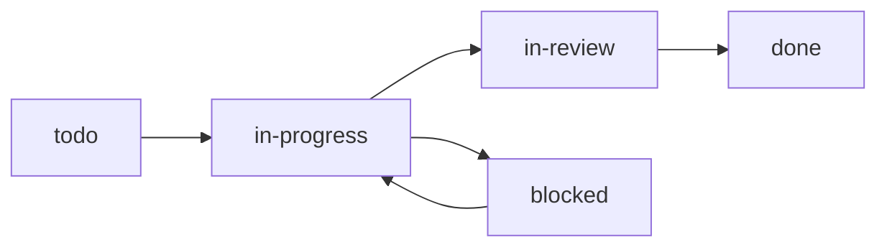
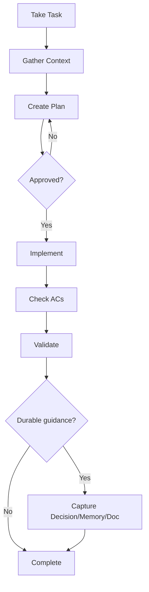

# Workflow Guide

Task lifecycle from creation to completion. Full docs: `./docs/workflow.md`

## Task Lifecycle



## Standard Workflow



### 1. Take Task
```bash
knowns task edit <id> -s in-progress -a @me
knowns time start <id>
```

### 2. Gather Context
```bash
# Follow refs in task description
knowns doc "<ref>" --plain
knowns search "<keywords>" --type doc --plain
```

### 3. Plan (Wait for Approval)
```bash
knowns task edit <id> --plan $'1. Step one
2. Step two
3. Tests'
```
**Share plan with user, WAIT for approval before coding.**

### 4. Implement
```bash
# Check AC after completing each
knowns task edit <id> --check-ac 1
knowns task edit <id> --append-notes "Completed step 1"
```

### 5. Capture Durable Knowledge

Before marking work complete, ask: did this task create, change, or supersede guidance that future work should follow?

Use:

- **Decision** for durable project guidance: architecture choices, product behavior, workflow conventions, naming rules, storage models, API contracts, or explicit tradeoffs.
- **Memory** for concise reusable recall: implementation patterns, recurring failures, conventions, or facts that help future agents quickly.
- **Doc** for long-form knowledge: explanations, guides, patterns with examples, or domain references.

Decision rules:

- Create a Decision only when the choice is stable enough to guide future work.
- Link each Decision to at least one source, related doc, or related task so it has context.
- Supersede an older Decision when the new guidance replaces it; do not overwrite the old Decision.
- Do not create a Decision for routine progress notes, local implementation details, one-off bugs, or unresolved ideas.

```bash
knowns decision create "Use Qdrant as default vector DB" \
  --task <id> \
  --doc specs/vector-search \
  --decision "Use Qdrant for the default vector database."
```

### 6. Complete
```bash
knowns time stop
knowns task edit <id> -s done
```

## Time Tracking

```bash
knowns time start <id>    # Start timer
knowns time stop          # Stop timer
knowns time status        # Check current
knowns time add <id> 2h   # Manual entry
```

## Best Practices

1. **Read docs first** - Understand context before coding
2. **Plan before code** - Get approval on approach
3. **Track time** - Start/stop timer for each task
4. **Check ACs** - Only after work is actually done
5. **Capture durable guidance** - Use Decision for stable choices, Memory for quick recall, Doc for long-form knowledge
6. **Add notes** - Document progress and task-specific context

## AI Agent Checklist

- [ ] Read task description
- [ ] Follow all refs in task
- [ ] Search related docs
- [ ] Create plan, wait for approval
- [ ] Implement, check ACs progressively
- [ ] Validate tests/build/refs
- [ ] Decide whether durable guidance needs a Decision, Memory, or Doc
- [ ] Stop timer, mark done


## Completion, archive, and reopen

Marking a Task `done` removes it from default AI Retrieve immediately under the default project policy, while human Search still finds it. Archive is a later reversible storage transition and is preview-first; Hard Delete is a separately permission-gated irreversible operation.

Before archive, review durable-knowledge warnings and extract reusable Decisions, Memories, or Docs. See @doc/features/task-lifecycle for blockers, retention, batch retry, reopen, and Hard Delete behavior.
