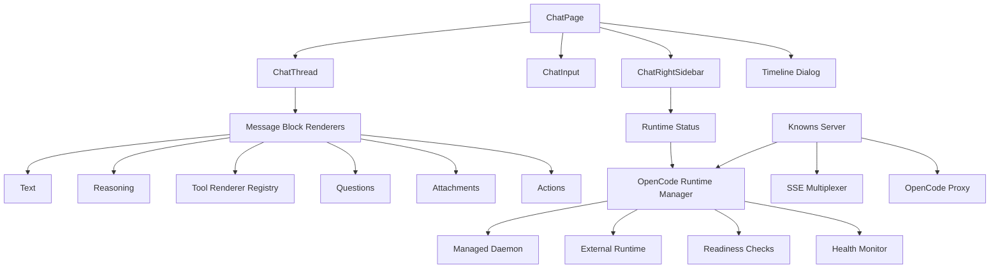

# Pattern: Atlas Chat Runtime

## Overview

Atlas Chat Runtime is a reference pattern for improving Knowns in two connected areas:

1. richer chat message rendering and interaction flow
2. more explicit OpenCode runtime management

This document intentionally uses the codename `Atlas` as a neutral reference architecture. It describes the patterns worth adopting without binding Knowns to the original implementation source.

Primary related docs:
- @doc/specs/chat-ui
- @doc/specs/chat-ui-revert-copy
- @doc/specs/session-info-panel
- @doc/specs/knowns-hub-mode
- @doc/specs/auto-download-opencode
- @doc/architecture/patterns/ui
- @doc/architecture/patterns/server

## Goals

- Improve message readability for long, tool-heavy AI conversations.
- Make chat navigation easier with timeline, jump, revert, and fork actions.
- Keep the current Knowns message model and avoid a full frontend rewrite.
- Preserve Knowns shared-daemon strengths while adding clearer runtime states and safer recovery.
- Support both desktop and mobile chat usage with a cleaner composer UX.

## Non-Goals

- Replacing the current `ChatMessage[]` model with a new turn/part architecture.
- Rewriting Knowns around a new frontend store system.
- Replacing the shared OpenCode daemon with app-owned child processes only.
- Copying the source system one-to-one.

## Atlas Principles

### 1. Reuse the current data model

Knowns already has a workable chat shape in `ui/src/models/chat.ts`:
- `content`
- `reasoning`
- `toolCalls`
- `questionBlocks`
- `attachments`
- `parentSessionId`
- `parentMessageId`

Atlas keeps that model and improves rendering around it.

### 2. Render by block, not by monolith

A message should be rendered as a stack of focused blocks instead of a single large component with mixed concerns.

Suggested block split:
- text block
- reasoning block
- tool output block
- question block
- attachment block
- error block
- action toolbar

### 3. Treat tool output as first-class UI

Tool results should not be rendered as plain text whenever a structured view is available.

### 4. Keep OpenCode ownership explicit

Knowns should always know which runtime mode it is in:
- managed daemon
- external server
- unavailable
- degraded / not ready

### 5. Prefer incremental adoption

Adopt new rendering and runtime patterns behind existing page structure where possible.

## Chat Rendering Pattern

### Current Knowns baseline

Current relevant UI surfaces:
- `ui/src/pages/ChatPage.tsx`
- `ui/src/components/chat/ChatThread.tsx`
- `ui/src/components/chat/MessageBubble.tsx`
- `ui/src/components/organisms/ChatPage/ChatInput.tsx`
- `ui/src/components/organisms/ChatPage/ChatRightSidebar.tsx`

The current structure is already sufficient to support an Atlas-style upgrade without changing the stored chat schema.

### Target render model

Each assistant message should be composed from ordered render blocks:

1. assistant metadata
2. main answer text
3. reasoning summary or expandable reasoning section
4. structured tool outputs
5. question prompts / approvals
6. attachments
7. message actions

Each user message should be composed from:

1. user text
2. uploaded files
3. message actions

### Specialized tool renderers

Atlas recommends adding a renderer registry keyed by tool name.

High-value renderers:
- `read`: line-numbered file preview with truncation awareness
- `grep`: grouped matches by file with line anchors
- `glob`: compact file list grouped by folder
- `bash`: command card with status, duration, and expandable output
- `apply_patch`: patch/diff viewer
- `todowrite`: checklist/status renderer
- `webfetch`: markdown/article style renderer
- `question`: answer selection UI with status feedback

Fallback rule:
- if no specialized renderer exists, render a generic structured card instead of a raw blob

### Message actions

Atlas message actions should be consistent and easy to scan:
- copy message
- revert to here
- fork from here
- retry last turn
- jump to source or related turn when applicable

These actions should live in a compact toolbar, ideally hover-visible on desktop and always accessible on mobile.

### Timeline and branching

Knowns already has the data needed to support timeline navigation:
- `parentSessionId`
- `parentMessageId`

Atlas recommends a dedicated timeline surface with:
- search messages by text
- jump to any message
- revert from a selected point
- fork a new session from a selected point
- show branch ancestry and current position

### Right sidebar pattern

`ChatRightSidebar.tsx` should evolve into a stable supporting panel for:
- session metadata
- active sub-agents
- current runtime status
- current model / provider / mode
- context usage summary
- quick links to timeline and related task/doc context

### Composer pattern

Atlas composer recommendations:
- session draft persistence
- attached file chips with remove/retry handling
- mobile control drawer for model / agent / effort controls
- clearer submit / stop / continue states
- preserve prompt history ergonomics without overloading the main text area

## OpenCode Runtime Pattern

### Current Knowns baseline

Current relevant backend surfaces:
- `internal/agents/opencode/daemon.go`
- `internal/agents/opencode/client.go`
- `internal/agents/opencode/detect.go`
- `internal/server/server.go`

Knowns currently does these things well:
- checks OpenCode installation and minimum version
- uses a shared daemon with PID file
- detaches the daemon so it can survive server restarts
- proxies OpenCode through Knowns
- multiplexes OpenCode SSE into Knowns SSE

These strengths should be preserved.

### Target runtime modes

Atlas recommends explicit runtime modes:

- `managed`
  - Knowns ensures the shared daemon is running
- `external`
  - Knowns attaches to an already-running OpenCode server
- `unavailable`
  - OpenCode is missing or incompatible
- `degraded`
  - runtime exists but readiness checks fail or recovery is in progress

### Readiness model

Knowns currently checks whether the server is available. Atlas recommends a deeper staged readiness model:

1. process exists or target host is reachable
2. `/global/health` reports healthy
3. `/config` responds successfully
4. `/agent` responds successfully
5. optional: required agent is present after config changes

This reduces cases where the server is technically up but not truly usable.

### Hybrid runtime strategy

Atlas does not replace the shared daemon. It extends it.

Recommended behavior:
- if external runtime is explicitly configured, use external mode first
- otherwise reuse an existing healthy daemon if present
- otherwise start the managed daemon
- expose the selected mode through API and UI status

### Health monitoring and recovery

Atlas recommends adding a lightweight health monitor in Knowns server runtime:
- periodic readiness check
- mark runtime as degraded when checks fail
- attempt controlled restart for managed mode
- never kill external runtime owned by another process
- keep last error, last healthy time, and restart count for debugging

### Runtime status surface

Chat UI should be able to show a concise runtime state:
- mode: managed or external
- status: ready, starting, degraded, unavailable
- host and port
- OpenCode version
- last error if any
- restart count if any

This should be available from a small status endpoint and shown inside the chat sidebar or toolbar.

## Recommended Architecture

## Suggested Implementation Order

### Phase 1: Message rendering

- Introduce renderer registry for tool calls.
- Split `MessageBubble` into smaller render blocks.
- Add specialized renderers for `read`, `grep`, `glob`, `bash`, diff/patch, and todo-like outputs.
- Normalize message action toolbar.

### Phase 2: Chat flow

- Add timeline dialog.
- Support jump, revert, and fork from message history.
- Wire `ChatRightSidebar` into `ChatPage.tsx` as a real supporting panel.

### Phase 3: Composer UX

- Add session draft persistence.
- Add mobile controls drawer.
- Improve attachment handling and send-state transitions.

### Phase 4: OpenCode runtime

- Add explicit managed vs external runtime mode.
- Add staged readiness checks.
- Add server-side health monitor and recovery logic.
- Add runtime status endpoint and surface it in chat UI.

## What Knowns Should Reuse

- Shared daemon with PID file
- SSE multiplexing from OpenCode into Knowns events
- Existing chat schema and storage
- Existing sidebar and composer entry points
- Existing revert/copy feature direction in @doc/specs/chat-ui-revert-copy

## What Knowns Should Avoid

- Full frontend rewrite around a new message architecture
- Tight coupling to a heavy synchronized client store
- Replacing daemon ownership with port-kill ownership as the primary model
- Large changes that block incremental rollout

## Decision Summary

Atlas is the recommended direction when Knowns needs:
- better rendering for tool-heavy chat sessions
- better history and branching navigation
- clearer runtime diagnostics for OpenCode
- stronger recovery behavior without losing daemon-based reuse

The key rule is simple:
- copy interaction patterns and operational lessons
- do not copy the original architecture wholesale
