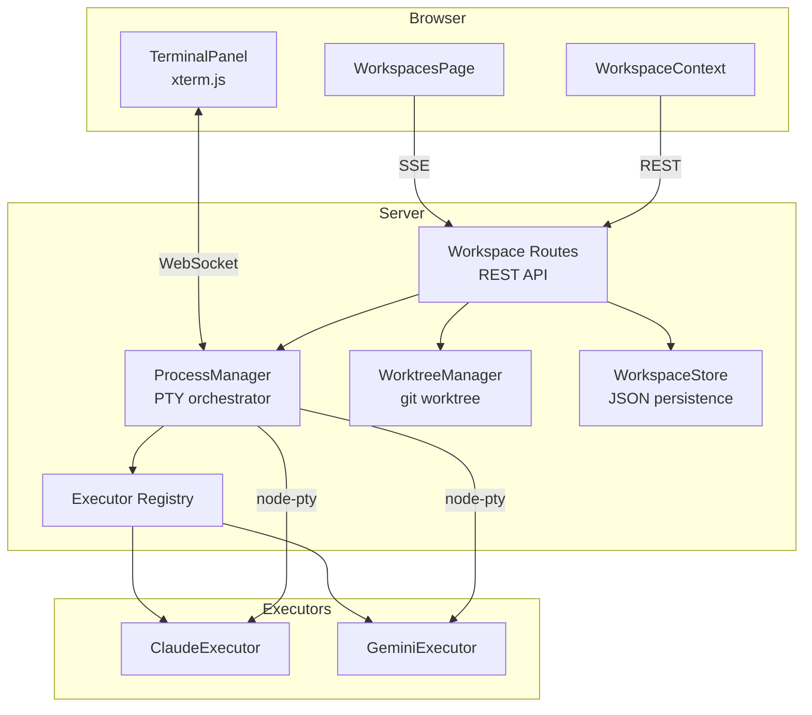

## Overview

Agent Workspace brings AI agent orchestration directly into the Knowns Browser (Web UI). Users can spawn AI coding agents (Claude Code, Gemini CLI), stream their terminal output in real-time via the browser, and isolate each agent in its own git worktree.

Inspired by [Vibe Kanban](https://github.com/BloopAI/vibe-kanban), but built natively into Knowns with Go backend and React UI.

**Related docs:**
- @doc/architecture/patterns/agent-executor-pattern - Executor pattern for agent abstraction
- @doc/features/workspace-system - Process manager, worktree, WebSocket architecture

---
## Goals

1. **Spawn AI agents from browser** - Create workspaces, assign agents, start with a prompt
2. **Stream terminal output** - Full PTY emulation with ANSI colors via xterm.js
3. **Git worktree isolation** - Each workspace gets its own branch and working directory
4. **Link to Knowns tasks** - Optionally connect a workspace to a task for context
5. **Extensible agent support** - Executor pattern makes adding new agents trivial

---

## Architecture



**Key decisions:**
- **SSE** (existing) for workspace status broadcasts (created/updated/deleted)
- **WebSocket** (new) only for terminal byte stream (bidirectional)
- **JSON storage** for workspaces (ephemeral session data, not markdown)
- **node-pty** for full PTY emulation (ANSI colors, cursor movement)

---

## Data Model

```typescript
type WorkspaceStatus =
  | "creating"   // Worktree being set up
  | "idle"       // Created but agent not running
  | "running"    // Agent process is active
  | "stopped"    // Agent exited (success or failure)
  | "error"      // Setup/worktree failure
  | "cleaning";  // Worktree being removed

type AgentType = "claude" | "gemini";

interface Workspace {
  id: string;               // ws-{6char}
  name: string;             // User-defined or auto-generated
  agentType: AgentType;
  taskId?: string;           // Linked Knowns task (optional)
  worktreePath: string;      // Absolute path to git worktree
  worktreeBranch: string;    // Branch: knowns/ws-{id}
  status: WorkspaceStatus;
  pid?: number;              // OS process ID
  exitCode?: number;         // Exit code when stopped
  prompt?: string;           // Instruction given to agent
  createdAt: Date;
  startedAt?: Date;
  stoppedAt?: Date;
  error?: string;
}
```

**Storage:** `.knowns/workspaces.json` (JSON, not markdown - ephemeral data)

---

## API Endpoints

| Method | Endpoint | Description |
|--------|----------|-------------|
| GET | `/api/workspaces` | List all workspaces |
| GET | `/api/workspaces/agents` | List available agent types |
| GET | `/api/workspaces/:id` | Get workspace details |
| POST | `/api/workspaces` | Create workspace + worktree |
| POST | `/api/workspaces/:id/start` | Start agent in workspace |
| POST | `/api/workspaces/:id/stop` | Stop running agent |
| DELETE | `/api/workspaces/:id` | Delete workspace + cleanup worktree |
| WS | `/ws/terminal?workspaceId=X` | Terminal byte stream |

### WebSocket Protocol

```typescript
// Server → Client
{ type: "output", data: string }      // Terminal output chunk
{ type: "buffer", data: string[] }    // Scrollback on connect
{ type: "status", status: string }    // Status change

// Client → Server
{ type: "resize", cols: number, rows: number }
{ type: "input", data: string }       // Keyboard input
```

### SSE Events (via existing system)

```
workspaces:created  → { workspace: Workspace }
workspaces:updated  → { workspace: Workspace }
workspaces:deleted  → { workspaceId: string }
```

---

## UI Layout

Page route: `#/workspaces`

Layout chi tiết và mockups nằm trong từng task implementation. Xem tasks liên quan bên dưới.

### Components Overview

| Component | Type | Description |
|-----------|------|-------------|
| `WorkspacesPage` | page | Main page with split-view layout |
| `WorkspaceList` | organism | Sidebar list with status badges |
| `WorkspaceDetail` | organism | Header + terminal + status bar |
| `TerminalPanel` | organism | xterm.js integration + WebSocket |
| `WorkspaceCreateDialog` | organism | Create form (name, agent, task, prompt) |
| `WorkspaceStatusBadge` | molecule | Colored status indicator |
| `AgentBadge` | molecule | Agent type icon + name |
| `WorkspaceContext` | context | State management + SSE subscription |
| `useTerminalWebSocket` | hook | WebSocket connection for terminal |
## Dependencies

| Package | Purpose |
|---------|---------|
| `node-pty` | Pseudo-terminal for agent processes |
| `ws` + `@types/ws` | WebSocket server |
| `@xterm/xterm` | Terminal emulator in browser |
| `@xterm/addon-fit` | Auto-resize terminal |
| `@xterm/addon-web-links` | Clickable links in terminal |

> Note: `node-pty` is a native module. Project already uses `better-sqlite3` (native) so build toolchain is compatible.

---

## Implementation Phases

### Phase 1: Foundation (Backend)
- Data model (legacy spec path under old TS layout)
- Workspace store (legacy spec path under old TS layout)
- Git worktree manager (legacy spec path under old TS layout)
- Executor abstraction + Claude/Gemini executors
- Process manager with PTY + output buffer

### Phase 2: Server Integration
- REST API routes (legacy spec path under old TS layout)
- WebSocket server on `/ws/terminal`
- SSE event types for workspace status
- Graceful shutdown handling

### Phase 3: UI Foundation
- API client extension (`workspaceApi`)
- WebSocket hook (`useTerminalWebSocket`)
- Workspace context + SSE subscription

### Phase 4: UI Components
- TerminalPanel (xterm.js)
- WorkspaceList, WorkspaceDetail, WorkspaceCreateDialog
- Status and agent badges

### Phase 5: Page Assembly
- WorkspacesPage with split-view layout
- Navigation item in AppSidebar
- Route registration in App.tsx

### Phase 6: Error Handling
- Agent crash recovery
- Server restart detection
- WebSocket reconnection
- Orphaned worktree cleanup

---

## File Structure

### New files (19)

```
src/models/workspace.ts
src/server/workspace/workspace-store.ts
src/server/workspace/worktree-manager.ts
src/server/workspace/process-manager.ts
src/server/workspace/executors/base.ts
src/server/workspace/executors/claude.ts
src/server/workspace/executors/gemini.ts
src/server/workspace/executors/registry.ts
src/server/workspace/index.ts
src/server/routes/workspaces.ts
src/ui/hooks/use-terminal-ws.ts
src/ui/contexts/WorkspaceContext.tsx
src/ui/components/molecules/WorkspaceStatusBadge.tsx
src/ui/components/molecules/AgentBadge.tsx
src/ui/components/organisms/workspace/TerminalPanel.tsx
src/ui/components/organisms/workspace/WorkspaceList.tsx
src/ui/components/organisms/workspace/WorkspaceCreateDialog.tsx
src/ui/components/organisms/workspace/WorkspaceDetail.tsx
src/ui/pages/WorkspacesPage.tsx
```

### Modified files (6)

```
package.json                              → Add dependencies
src/server/index.ts                       → WebSocket server, ProcessManager, cleanup
src/server/routes/index.ts                → Register workspace routes
src/ui/App.tsx                            → Route, provider, lazy import
src/ui/components/organisms/AppSidebar.tsx → Nav item
src/ui/api/client.ts                      → workspaceApi
```

Current repo note: this spec predates the Go rewrite and still references the old `src/...` layout. Equivalent current surfaces include @code/ui/src/api/client.ts and route/server files under @code/internal/server/.

---

## Acceptance Criteria

- [x] AC-1: User can create a workspace from browser UI
- [x] AC-2: Workspace creates an isolated git worktree
- [x] AC-3: User can start an agent (Claude Code or Gemini CLI) in a workspace
- [x] AC-4: Terminal output streams in real-time to browser via xterm.js
- [x] AC-5: User can stop a running agent
- [x] AC-6: User can delete a workspace (cleans up worktree)
- [x] AC-7: Multiple workspaces can run agents in parallel
- [x] AC-8: Late-joining browser clients see scrollback buffer
- [x] AC-9: Agent crash updates workspace status with exit code
- [x] AC-10: Server restart marks running workspaces as stopped
- [x] AC-11: Workspace can be linked to a Knowns task
