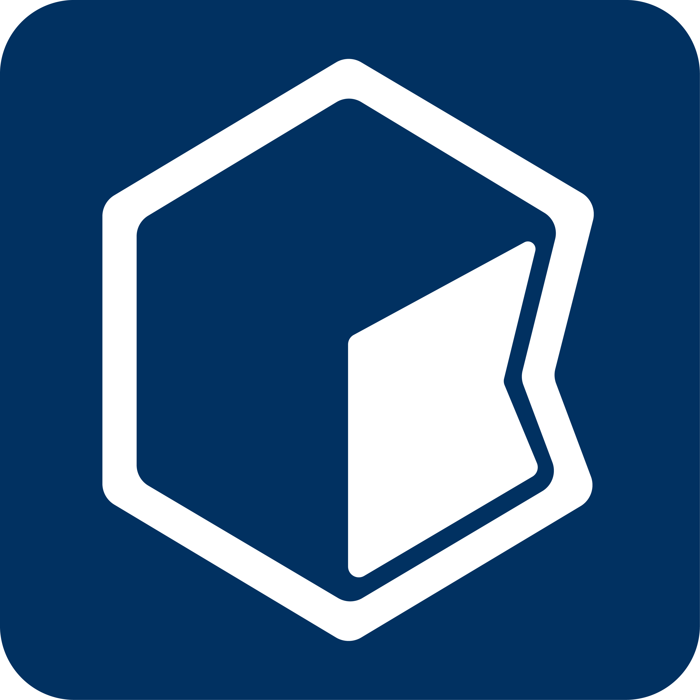

<p align="center">
  
</p>

# Knowns

<p align="center">
  <a href="https://go.dev/"></a>
  <a href="https://www.npmjs.com/package/knowns"></a>
  <a href="https://github.com/knowns-dev/knowns/actions/workflows/ci.yml"></a>
  <a href="#installation"></a>
  <a href="LICENSE"></a>
</p>

<p align="center">
  <strong>Give your AI coding assistant structured access to tasks, docs, specs, and decisions — so it stops guessing and starts building.</strong>
</p>

---

Every time you start a new AI coding session, you re-explain your architecture, paste docs, repeat conventions, and clarify past decisions. Your AI assistant is powerful — but it forgets everything between sessions.

**Knowns fixes that.** It gives AI assistants like Claude, Cursor, Copilot, and others structured, persistent access to your project's tasks, documentation, specs, acceptance criteria, and architectural decisions. Instead of prompting from scratch, your AI reads what it needs and picks up where you left off.

⭐ If you believe AI should truly understand software projects, consider giving **Knowns** a star.

<p align="center">
  
</p>

## Table of Contents

- [Why Knowns?](#why-knowns)
- [Before & After](#before--after)
- [What is Knowns?](#what-is-knowns)
- [Who It's For](#who-its-for)
- [How It Works](#how-it-works)
- [Quick Start](#quick-start)
- [Core Capabilities](#core-capabilities)
- [What You Can Build](#what-you-can-build-with-knowns)
- [Claude Code Skills Workflow](#claude-code-skills-workflow)
- [Installation](#installation)
- [Documentation](#documentation)
- [Roadmap](#roadmap)
- [Development](#development)
- [Links](#links)

---

## Why Knowns?

AI coding assistants are stateless. Every session starts from zero.

That means you end up doing the same work over and over:

- **Re-explaining** your architecture and design patterns
- **Pasting** documentation into chat windows
- **Repeating** coding conventions and project rules
- **Clarifying** decisions that were already made last week
- **Rebuilding** context that took 20 minutes to set up

The AI doesn't lack intelligence. **It lacks access to what your project already knows.**

Knowns gives it that access.

---

## Before & After

| Without Knowns | With Knowns |
|---|---|
| "We use the repository pattern with..." _(paste 50 lines)_ | AI reads `@doc/patterns/repository` automatically |
| "Here's the task, the acceptance criteria are..." _(re-type everything)_ | AI reads the task, its ACs, linked specs, and related docs |
| "Remember, we decided last week to..." _(hope it sticks)_ | Decision is stored in project memory — AI recalls it every session |
| "The auth flow works like this..." _(explain for the 4th time)_ | AI follows `@doc/architecture/auth` and builds on it |
| "Are we done? Let me check the requirements again..." | AI checks acceptance criteria and validates completion itself |
| Session starts cold — 10 min of context-setting | Session starts warm — AI already knows the project |

---

## What is Knowns?

Knowns is a **local-first, self-hostable project context layer** for AI-native development.

It stores your project knowledge in structured, AI-readable files — and exposes them to AI assistants through CLI and [MCP (Model Context Protocol)](https://modelcontextprotocol.io/).

<p align="center">
  
</p>

Concretely, Knowns manages:

- **Tasks** with acceptance criteria, implementation plans, and status tracking
- **Documentation** in nested markdown folders with cross-references
- **Specs** that define what "done" looks like for a feature
- **Memory** — project-level, session-level, and global knowledge that AI can recall
- **Templates** for code generation with Handlebars
- **References** like `@task-42` and `@doc/patterns/auth` that AI can follow and resolve
- **Code intelligence** — AST-indexed symbols, dependency graphs, and semantic code search

Everything lives in a `.knowns/` directory in your repo. Plain files. Committable to Git. No cloud required.

---

## Who It's For

- **Solo developers** who pair with AI daily and want it to remember project context across sessions
- **Teams** building with AI assistants and tired of everyone re-explaining the same architecture
- **Open-source maintainers** who want contributors (human or AI) to onboard faster
- **Anyone** who uses Claude, Cursor, Copilot, Windsurf, or other AI coding tools and wants them to actually understand the project

---

## How It Works

Knowns sits alongside your existing tools. Your stack stays the same.

<p align="center">
  
</p>

1. **You structure your project knowledge** — tasks, docs, specs, decisions — using the Knowns CLI or Web UI
2. **AI reads it** — through MCP integration or CLI commands, your AI assistant accesses exactly the context it needs
3. **AI acts on it** — follows references, checks acceptance criteria, updates task status, and builds with full awareness
4. **Knowledge accumulates** — decisions, patterns, and conventions persist across sessions instead of disappearing

Your specs → understood. Your tasks → connected. Your docs → usable. Your decisions → remembered.

---

## Quick Start

```bash
# Install
brew install knowns-dev/tap/knowns
# or: npm install -g knowns
# or: curl -fsSL https://knowns.sh/script/install | sh

# Initialize in your project
cd your-project
knowns init

# Create your first task
knowns task create "Add user authentication" \
  -d "JWT-based auth with login and register endpoints" \
  --ac "User can register with email/password" \
  --ac "User can login and receive JWT token" \
  --ac "Protected routes reject unauthenticated requests"

# Add project documentation
knowns doc create "Auth Architecture" \
  -f "architecture" \
  -d "Authentication design decisions and patterns"

# Open the Web UI
knowns browser --open

# Connect to your AI assistant via MCP
# See: docs/mcp-integration.md
```

Now when your AI reads the project, it sees structured tasks with acceptance criteria, linked documentation, and clear definitions of done — instead of guessing.

---

## Core Capabilities

### 📋 Task & Workflow Management

Create tasks with acceptance criteria, implementation plans, and status tracking. AI can read tasks, follow plans, check off ACs, and know exactly when work is complete.

```bash
knowns task create "Title" --ac "Criterion 1" --ac "Criterion 2"
knowns task edit <id> -s in-progress
knowns task edit <id> --check-ac 1
```

### 📖 Structured Documentation

Organize project knowledge in nested markdown folders. Cross-reference with `@doc/path` and `@task-id`. AI follows these references to load exactly the context it needs.

```bash
knowns doc create "API Design" -f "architecture"
knowns doc "architecture/api-design" --smart --plain
```

### 🧠 Project Memory

Three-layer memory system — **project**, **session**, and **global** — so AI recalls decisions, patterns, and conventions without you repeating them.

```bash
knowns memory add "We use repository pattern for data access" --category decision
knowns memory list --plain
```

### 🔍 Semantic Search

Search by meaning, not just keywords. Runs locally with ONNX models — fully offline, no API keys needed.

```bash
knowns search "how does authentication work" --plain
```

### 🤖 MCP Integration

Full [Model Context Protocol](https://modelcontextprotocol.io/) server. Claude, Cursor, and other MCP-compatible assistants get native access to tasks, docs, memory, search, and validation — no copy-pasting required.

### 🏗️ Code Intelligence

AST-based indexing for Go, TypeScript, JavaScript, and Python. Search symbols, trace dependencies, and explore your codebase structure — all accessible to AI.

```bash
knowns code ingest
knowns code search "oauth login" --neighbors 5
knowns code deps --type calls
```

### 🔄 Templates & Code Generation

Handlebars-based templates for scaffolding. Define patterns once, generate consistently.

```bash
knowns template list
knowns template run <name> --name "UserService"
```

### 🖥️ AI Agent Workspaces

Multi-phase agent orchestration with git worktree isolation, live terminal streaming, and automatic phase progression (research → plan → implement → review).

### 🌐 Web UI

Kanban board, document browser, knowledge graph visualization, and mermaid diagram support — all in a local browser UI.

```bash
knowns browser --open
```

---

## What You Can Build With Knowns

| Capability | What It Does |
|---|---|
| **Task Management** | Tasks with acceptance criteria, plans, status, and time tracking |
| **Documentation** | Nested markdown folders with cross-references and mermaid support |
| **Semantic Search** | Meaning-based search with local AI models (fully offline) |
| **Time Tracking** | Built-in timers and reports per task |
| **Context Linking** | `@task-42` and `@doc/patterns/auth` references AI can resolve |
| **Validation** | Detect broken references and incomplete tasks with `knowns validate` |
| **Template System** | Code generation with Handlebars (`.hbs`) templates |
| **Import System** | Import docs and templates from git, npm, or local sources |
| **Memory System** | Project / session / global memory for persistent AI recall |
| **MCP Server** | Native AI assistant integration with full tool access |
| **AI Workspaces** | Multi-phase agent orchestration with worktree isolation |
| **Code Intelligence** | AST indexing, symbol search, and dependency graphs |
| **Web UI** | Kanban board, doc browser, knowledge graph, mermaid diagrams |

---

## Claude Code Skills Workflow

When using Claude Code with Knowns, skills (slash commands) provide a guided workflow:

<p align="center">
  
</p>

```
/kn-init     → Read project docs, understand context
/kn-plan     → Take task, gather context, create plan (wait for approval)
/kn-implement → Follow plan, check ACs, track progress
/kn-commit   → Commit with conventional format
```

### Example Session

```
You: /kn-init
Claude: [Reads README, ARCHITECTURE, checks task backlog]
        "Project uses NestJS with CQRS pattern. 3 tasks in-progress..."

You: /kn-plan 42
Claude: [Takes task, reads refs, searches docs]
        "Task #42: Add user authentication

         ## Implementation Plan
         1. Review @doc/patterns/auth
         2. Create AuthModule with JWT strategy
         3. Add login/register endpoints
         4. Write unit tests

         Approve this plan?"

You: Yes

You: /kn-implement 42
Claude: [Follows plan, generates code, checks ACs]
        "✓ AC1: User can login - DONE
         ✓ AC2: JWT token returned - DONE
         ✓ AC3: Tests pass - DONE

         All acceptance criteria complete. Ready to commit?"

You: /kn-commit
Claude: [Creates conventional commit]
        "feat(auth): add JWT authentication

         - Add AuthModule with passport JWT strategy
         - Add login/register endpoints
         - Add unit tests (94% coverage)"
```

### All Skills

| Skill | Description |
|---|---|
| `/kn-init` | Initialize session — read docs, load memory, understand project |
| `/kn-plan <id>` | Take task, gather context, create implementation plan |
| `/kn-implement <id>` | Execute plan, track progress, check acceptance criteria |
| `/kn-research` | Search codebase, find patterns, explore before coding |
| `/kn-commit` | Create conventional commit with verification |
| `/kn-spec` | Create specification document for features (SDD) |
| `/kn-go <spec>` | Full pipeline from approved spec (no review gates) |
| `/kn-verify` | Run SDD verification and coverage report |
| `/kn-review` | Multi-perspective code review (P1/P2/P3 severity) |
| `/kn-doc` | Create or update documentation |
| `/kn-extract` | Extract reusable patterns into docs, templates, and memory |
| `/kn-template` | List, run, or create code templates |
| `/kn-debug` | Debug errors and failures with memory-backed triage |

---

## Installation

### Homebrew (macOS/Linux)

```bash
brew install knowns-dev/tap/knowns
```

### Shell installer (macOS/Linux)

```bash
curl -fsSL https://knowns.sh/script/install | sh

# Or with wget
wget -qO- https://knowns.sh/script/install | sh

# Install a specific version
curl -fsSL https://knowns.sh/script/install | KNOWNS_VERSION=0.18.0 sh
```

### PowerShell installer (Windows)

```powershell
irm https://knowns.sh/script/install.ps1 | iex

# Install a specific version
$env:KNOWNS_VERSION = "0.18.0"; irm https://knowns.sh/script/install.ps1 | iex
```

The shell installer on macOS/Linux and the PowerShell installer on Windows both auto-run `knowns search --install-runtime` after installing the binary. If that step fails, rerun it manually.

### npm

```bash
# Global install — auto-downloads platform-specific binary
npm install -g knowns

# Or run without installing
npx knowns
```

### From source (Go 1.24.2+)

```bash
go install github.com/howznguyen/knowns/cmd/knowns@latest

# Or clone and build
git clone https://github.com/knowns-dev/knowns.git
cd knowns
make build        # Output: bin/knowns
make install      # Install to GOPATH/bin
```

### Uninstall

```bash
# macOS/Linux
curl -fsSL https://knowns.sh/script/uninstall | sh

# Windows
irm https://knowns.sh/script/uninstall.ps1 | iex
```

The uninstall scripts only remove installed CLI binaries and PATH entries added by the installer. They leave project `.knowns/` folders untouched.

---

## Quick Reference

```bash
# Tasks
knowns task create "Title" -d "Description" --ac "Criterion"
knowns task list --plain
knowns task <id> --plain
knowns task edit <id> -s in-progress -a @me
knowns task edit <id> --check-ac 1

# Documentation
knowns doc create "Title" -d "Description" -f "folder"
knowns doc "doc-name" --plain
knowns doc "doc-name" --smart --plain
knowns doc "doc-name" --section "2" --plain

# Templates
knowns template list
knowns template run <name> --name "X"
knowns template create <name>

# Imports
knowns import add <name> <source>
knowns import sync
knowns import list

# Time, Search & Validate
knowns time start <id> && knowns time stop
knowns search "query" --plain
knowns validate

# Code intelligence
knowns code ingest
knowns code search "oauth login" --neighbors 5
knowns code deps --type calls
knowns code symbols --kind function

# AI Guidelines
knowns agents --sync
knowns sync
```

---

## Documentation

| Guide | Description |
|---|---|
| [User Guide](./docs/user-guide.md) | Getting started and daily usage |
| [Command Reference](./docs/commands.md) | All CLI commands with examples |
| [Workflow Guide](./docs/workflow.md) | Task lifecycle from creation to completion |
| [MCP Integration](./docs/mcp-integration.md) | Claude Desktop / Cursor setup with MCP tools |
| [Reference System](./docs/reference-system.md) | How `@doc/` and `@task-` linking works |
| [Semantic Search](./docs/semantic-search.md) | Setup and usage of AI-powered search |
| [Templates](./docs/templates.md) | Code generation with Handlebars |
| [Web UI](./docs/web-ui.md) | Kanban board, doc browser, and knowledge graph |
| [Configuration](./docs/configuration.md) | Project structure and options |
| [Skills](./docs/skills.md) | Claude Code skills reference |
| [Developer Guide](./docs/developer-guide.md) | Technical docs for contributors |
| [Multi-Platform](./docs/multi-platform.md) | Cross-platform build and distribution |

---

## Roadmap

### AI Agent Workspaces ✅ (Active)

Multi-phase agent orchestration — assign tasks to AI agents with git worktree isolation, live terminal streaming, and automatic phase progression (research → plan → implement → review).

### Self-Hosted Team Sync 🚧 (Planned)

Optional self-hosted sync server for shared visibility without giving up local-first workflows.

- **Real-time visibility** — See who is working on what
- **Shared knowledge** — Sync tasks and documentation across the team
- **Full data control** — Self-hosted, no cloud dependency

---

## Development

Requires **Go 1.24.2+** and optionally **Node.js + pnpm** for UI development.

```bash
make build              # Build binary → bin/knowns
make dev                # Build with race detector
make test               # Run unit tests
make test-e2e           # Run CLI + MCP E2E tests
make test-e2e-semantic  # E2E tests including semantic search
make lint               # Run golangci-lint
make cross-compile      # Build for all 6 platforms
make ui                 # Rebuild embedded Web UI (requires pnpm)
```

### Project Structure

```
cmd/knowns/          # CLI entry point
internal/
  cli/               # Cobra commands
  models/            # Domain models
  storage/           # File-based storage (.knowns/)
  server/            # HTTP server, SSE, WebSocket
    routes/          # REST API handlers
    workspace/       # Agent orchestrator, process manager, worktree
  mcp/               # MCP server (stdio)
  search/            # Semantic search (ONNX)
ui/                  # Embedded React UI (built assets)
tests/               # E2E tests
```

---

## Links

- [npm](https://www.npmjs.com/package/knowns)
- [GitHub](https://github.com/knowns-dev/knowns)
- [Discord](https://discord.knowns.dev)
- [Changelog](./CHANGELOG.md)

For design principles and long-term direction, see [Philosophy](./PHILOSOPHY.md).

For technical details, see [Architecture](./ARCHITECTURE.md) and [Contributing](./CONTRIBUTING.md).

---

<p align="center">
  <strong>What your AI should have knowns.</strong><br>
  Built for dev teams who pair with AI.
</p>
