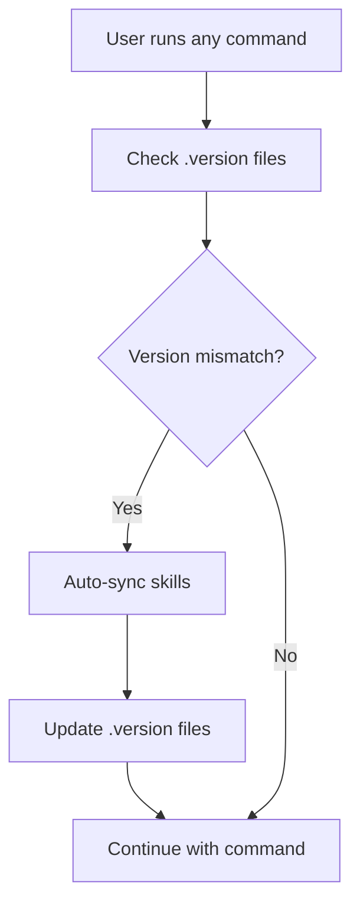

# Auto-Sync

Knowns automatically syncs skills when it detects a CLI version change.

---

## How It Works

1. Each platform directory (`.claude/skills/`, `.agent/skills/`) has a `.version` file
2. When running any Knowns command, the CLI checks the version in `.version`
3. If version differs from current CLI → auto-sync skills

**Flow:**



---

## Version File

**Location:**
- `.claude/skills/.version`
- `.agent/skills/.version`

**Format:**
```json
{
  "cliVersion": "0.11.3",
  "syncedAt": "2026-02-24T07:18:07.960Z"
}
```

| Field | Description |
|-------|-------------|
| `cliVersion` | CLI version when synced |
| `syncedAt` | Sync timestamp (ISO 8601) |

---

## Auto-Sync Output

When auto-sync occurs, you'll see a message:

```
✓ Auto-synced 10 skills for claude, antigravity (0.11.2 → 0.11.3)
```

**Format:** `✓ Auto-synced {count} skills for {platforms} ({oldVersion} → {newVersion})`

---

## When Auto-Sync Triggers

| Scenario | Auto-Sync? |
|----------|------------|
| CLI upgraded (npm update) | ✓ |
| First time (no .version file) | ✓ |
| .version file deleted | ✓ |
| Same version | ✗ |
| Platform directory doesn't exist | ✗ |

**Note:** Auto-sync only occurs if the platform directory already exists. If you haven't initialized, nothing gets synced.

---

## Manual Sync

To force sync manually:

```bash
# Sync all skills
knowns sync skills

# Force overwrite existing
knowns sync skills --force

# Sync with specific mode
knowns sync skills --mode mcp   # MCP tools
knowns sync skills --mode cli   # CLI commands
```

---

## Platforms Synced

Auto-sync only syncs platforms that have been initialized:

| Platform | Directory | Synced When |
|----------|-----------|-------------|
| Claude Code | `.claude/skills/` | Directory exists |
| Antigravity | `.agent/skills/` | Directory exists |

**Cursor, Windsurf, Cline:** Not auto-synced (require manual sync if needed).

---

## Deprecated Skills Cleanup

Auto-sync also automatically cleans up old skill folders:

| Old Format | Status |
|------------|--------|
| `knowns.*` | Removed |
| `kn:*` | Removed |

**Current format:** `kn-init`, `kn-plan`, `kn-implement`, etc.

---

## Implementation

**File:** `src/utils/auto-sync.ts`

```typescript
export function checkAndAutoSync(cliVersion: string): {
  synced: boolean;
  message?: string;
}
```

**Called from:** `src/index.ts` (before executing command)

---

## Disable Auto-Sync

Currently there's no option to disable auto-sync. If you want to skip:

1. Delete the platform directory (`.claude/skills/` or `.agent/skills/`)
2. Auto-sync won't run because the directory doesn't exist

---

## Related

- [Multi-Platform Support](./multi-platform.md) - Supported platforms
- [Skills](./skills.md) - Skill system
- [Configuration](./configuration.md) - Project configuration
