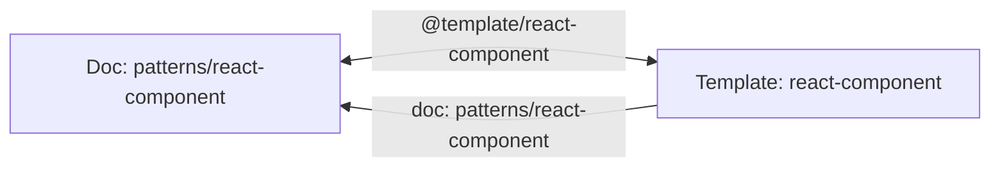

# Reference System

How to link tasks, documentation, and templates using `@` syntax.

## Overview

Knowns uses `@` references to create links between tasks, documentation, and templates. This allows AI assistants to automatically fetch related context.

## Reference Formats

### Task References

| Format | Example | Description |
|--------|---------|-------------|
| Task ref | `@task-42` | Links to task 42 |
| Task ref | `@task-pdyd2e` | Links to task pdyd2e |

### Document References

| Format | Example | Description |
|--------|---------|-------------|
| Doc ref | `@doc/patterns/auth` | Without .md extension |
| Doc ref | `@doc/patterns/auth.md` | With .md extension |

### Template References

| Format | Example | Description |
|--------|---------|-------------|
| Template ref | `@template/react-component` | Links to template |
| Template ref | `@template/api-endpoint` | Links to template |

## Usage Examples

### In Task Description

```bash
knowns task create "Add login endpoint" \
  -d "Implement JWT login following @doc/patterns/auth. Related: @task-38"
```

### In Document Content

```markdown
# Authentication Guide

This guide covers our authentication patterns.

## Related Tasks
- @task-42 - Initial auth implementation
- @task-45 - Add refresh tokens

## See Also
- @doc/patterns/jwt-tokens
- @doc/security/best-practices

## Related Templates
- @template/api-endpoint - Generate auth endpoints
```

### In Template Config

Templates can link to documentation:

```yaml
# .knowns/templates/react-component/_template.yaml
name: react-component
description: React functional component
doc: architecture/patterns/ui    # Links to @doc/architecture/patterns/ui
```

### In Implementation Plan

```bash
knowns task edit 42 --plan $'1. Review @doc/patterns/auth
2. Check @task-38 for prior implementation
3. Follow @doc/api-guidelines for endpoint design'
```

## How AI Uses References

When an AI assistant reads a task with references:

```
1. AI requests task #42
2. Knowns returns task content with refs:
   "Implement auth following @doc/patterns/auth"
3. AI sees the reference
4. AI requests @doc/patterns/auth
5. Knowns returns document content
6. AI now has full context
```

### Example Flow

```
You: "Work on task 42"

AI: [Reads task 42]
    Description: "Add JWT auth following @doc/patterns/auth"

AI: [Sees @doc/patterns/auth reference]
    [Fetches patterns/auth.md]

AI: "I see this task requires JWT authentication.
    According to your auth pattern doc:
    - Use 15-minute access tokens
    - Use 7-day refresh tokens
    - Store refresh tokens in httpOnly cookies

    I'll implement following these patterns..."
```

## Reference Resolution

### Task References

| Input | Resolves To |
|-------|-------------|
| `@task-42` | `.knowns/tasks/task-42 - Title.md` |
| `@task-1` | `.knowns/tasks/task-1 - Title.md` |

### Document References

| Input | Resolves To |
|-------|-------------|
| `@doc/auth` | `.knowns/docs/auth.md` |
| `@doc/patterns/auth` | `.knowns/docs/patterns/auth.md` |
| `@doc/patterns/auth.md` | `.knowns/docs/patterns/auth.md` |

### Template References

| Input | Resolves To |
|-------|-------------|
| `@template/react-component` | `.knowns/templates/react-component/` |
| `@template/api-endpoint` | `.knowns/templates/api-endpoint/` |

## Template-Doc Bidirectional Linking

Templates and docs can reference each other:



AI can follow links in both directions to understand context.

## Best Practices

### 1. Reference Early

Include references in the task description, not just notes:

```bash
# Good - AI sees context immediately
knowns task create "Add caching" \
  -d "Implement Redis caching per @doc/patterns/caching"

# Less good - context buried in notes
knowns task create "Add caching" -d "Implement caching"
# Then later...
knowns task edit 1 --notes "See @doc/patterns/caching"
```

### 2. Create Documentation First

Document patterns before referencing them:

```bash
# 1. Create the pattern doc
knowns doc create "Caching Pattern" \
  -d "Redis caching strategy" \
  -f patterns

# 2. Then reference it in tasks
knowns task create "Add user cache" \
  -d "Cache user data per @doc/patterns/caching-pattern"
```

### 3. Use Descriptive Paths

Organize docs in folders for clarity:

```
.knowns/docs/
├── readme.md
├── ai/
│   ├── overview.md
│   ├── platforms.md
│   └── skills.md
├── architecture/
│   ├── overview.md
│   ├── patterns/
│   │   ├── command.md
│   │   └── storage.md
│   └── features/
│       └── init-process.md
├── core/
│   └── time-tracking.md
├── guides/
│   └── user-guide.md
└── templates/
    └── overview.md
```

Reference with full path:
- `@doc/ai/skills`
- `@doc/architecture/patterns/command`
- `@doc/guides/user-guide`
- `@template/react-component`

### 4. Cross-Reference Related Items

Link related tasks and docs:

```bash
# In task description
-d "Implement feature. Blocked by @task-38. See @doc/patterns/x"

# In documentation
"Related tasks: @task-42, @task-45"
"See also: @doc/other-pattern"
```

## Viewing References

### CLI Output

```bash
$ knowns task 42 --plain

# Task 42: Add Authentication
Status: in-progress | Priority: high

## Description
Implement JWT auth following @doc/patterns/auth.
Related: @task-38 @task-39

## Acceptance Criteria
- [ ] User can login
- [ ] JWT token returned
```

### Web UI

References render as clickable badges:
- Task refs: Green badges with task number and title
- Doc refs: Blue badges with document title
- Template refs: Purple badges with template name

Click to navigate to the referenced item.

## How AI Uses Template References

When an AI sees a template reference:

```
1. AI reads doc with @template/react-component
2. AI fetches template config and linked doc
3. AI understands:
   - What files will be generated
   - What prompts are needed
   - Related patterns from linked doc
4. AI can run the template with proper inputs
```

### Example: Using Template Reference

```
You: "Create a new UserProfile component"

AI: [Sees @template/react-component in patterns doc]
    [Fetches template config]
    [Fetches linked doc: patterns/react-component]

AI: "I'll use the react-component template.
    Based on the pattern doc, I'll include:
    - TypeScript props interface
    - Unit test file

    Running template..."

    $ knowns template run react-component --name UserProfile --withTest
```
