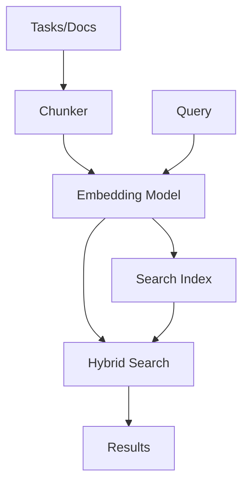

# Semantic Search Guide

Search tasks and docs by **meaning**, not just keywords. Uses local AI models for privacy and offline capability.

## Table of Contents

- [Getting Started](#getting-started)
- [Model Management](#model-management)
- [Search Usage](#search-usage)
- [Configuration](#configuration)
- [How It Works](#how-it-works)
- [Troubleshooting](#troubleshooting)

---

## Getting Started

### Enable During Init

```bash
knowns init my-project
# → "Enable semantic search?" [y/n] → y
# → "Select model:" → gte-small (recommended)
```

The model downloads automatically to `~/.knowns/models/` (shared across projects).

### Enable on Existing Project

```bash
# 1. Enable in config
knowns config set settings.semanticSearch.enabled true

# 2. Download model (if not already)
knowns model download gte-small

# 3. Build search index
knowns search --reindex
```

### Verify Setup

```bash
knowns search --status-check
# → Semantic: enabled (gte-small)
# → Index: 145 items, last updated 2m ago
# → Model: ~/.knowns/models/gte-small (67MB)
```

---

## Model Management

Models are stored globally at `~/.knowns/models/` and shared across all projects.

### Available Models

| Model              | Size  | Speed  | Quality | Best For                         |
| ------------------ | ----- | ------ | ------- | -------------------------------- |
| `gte-small`        | 67MB  | Fast   | Good    | Most projects (recommended)      |
| `all-MiniLM-L6-v2` | 80MB  | Fast   | Good    | Alternative option               |
| `gte-base`         | 220MB | Medium | Better  | Large projects with complex docs |

### Commands

```bash
# List downloaded models
knowns model list

# Download a model
knowns model download gte-small

# Remove a model
knowns model remove gte-small
```

### First Download

First model download may take 1-2 minutes depending on connection. Progress is shown:

```
Downloading gte-small...
[████████████████████] 100% (67MB)
Model saved to ~/.knowns/models/gte-small
```

---

## Search Usage

### Basic Search

```bash
# Semantic search (auto-enabled when configured)
knowns search "how to handle authentication errors"

# Force keyword-only search
knowns search "auth error" --keyword

# Search specific type
knowns search "api design" --type doc
knowns search "login bug" --type task
```

### Search Output

```bash
$ knowns search "user authentication flow"

DOCS (2 results):
  patterns/auth.md (score: 0.89)
    "JWT authentication pattern with refresh tokens..."

  api/endpoints.md (score: 0.72)
    "POST /auth/login - Authenticate user..."

TASKS (1 result):
  task-42: Add OAuth2 support (score: 0.68)
    Status: in-progress | Priority: high
```

### MCP Search

When using with Claude/AI via MCP:

```json
mcp__knowns__search({
  "query": "error handling patterns",
  "type": "doc"
})
```

---

## Configuration

### Config File

In `.knowns/config.json`:

```json
{
  "settings": {
    "semanticSearch": {
      "enabled": true,
      "model": "gte-small",
      "huggingFaceId": "Xenova/gte-small",
      "dimensions": 384
    }
  }
}
```

### Config Options

| Key             | Type    | Default       | Description                             |
| --------------- | ------- | ------------- | --------------------------------------- |
| `enabled`       | boolean | `false`       | Enable/disable semantic search          |
| `model`         | string  | `"gte-small"` | Model ID to use                         |
| `huggingFaceId` | string  | -             | HuggingFace ID for the selected model    |
| `dimensions`    | number  | -             | Embedding dimensions (auto-detected)    |

### CLI Config Commands

```bash
# Enable semantic search
knowns config set settings.semanticSearch.enabled true

# Change model
knowns config set settings.semanticSearch.model gte-base

# View current config
knowns config get settings.semanticSearch
```

---

## How It Works

### Architecture



### Storage

| Location                | Content              | Shared?          |
| ----------------------- | -------------------- | ---------------- |
| `~/.knowns/models/`     | Downloaded AI models | Yes (global)     |
| `.knowns/search-index/` | Project search index | No (per-project) |

### Indexing

Index includes:

- **Tasks** - All tasks in `.knowns/tasks/`
- **Local docs** - All docs in `.knowns/docs/`
- **Imported docs** - All docs from `.knowns/imports/*/docs/`

Index updates automatically when:

- Tasks created/updated
- Docs created/updated
- Manual reindex via `knowns search --reindex`

### Chunking Strategy

**Documents** are chunked by headings:

```
# Title        → Chunk 0 (metadata)
## Overview    → Chunk 1
## Install     → Chunk 2
### Step 1     → Chunk 2.1 (nested)
```

**Tasks** are chunked by fields:

```
Task → Chunk 0 (title + description)
     → Chunk 1 (acceptance criteria)
     → Chunk 2 (implementation plan)
```

### Hybrid Search

Combines two approaches:

1. **Semantic**: Find conceptually similar content (even with different words)
2. **Keyword**: Exact term matching for precision

Results are merged and ranked by combined score.

---

## Troubleshooting

### Model Not Found

```
Error: Model 'gte-small' not found
```

**Fix:**

```bash
knowns model download gte-small
```

### Index Out of Date

```
Warning: Search index is stale (last updated 7 days ago)
```

**Fix:**

```bash
knowns search --reindex
```

### Search Returns No Results

1. Check if semantic search is enabled:

   ```bash
   knowns search --status-check
   ```

2. Check if index exists:

   ```bash
   ls .knowns/search-index/
   ```

3. Rebuild index:
   ```bash
   knowns search --reindex
   ```

### Slow First Search

First search after startup loads the model into memory (~2-5 seconds). Subsequent searches are fast.

### High Memory Usage

Large models use more RAM. If memory is limited:

```bash
# Use smaller model
knowns config set settings.semanticSearch.model gte-small
knowns search --reindex
```

### Clone Repo - Search Not Working

Index is gitignored by default. After cloning:

```bash
knowns search --reindex
```

---

## Tips

1. **Start with `gte-small`** - Best balance of speed and quality
2. **Reindex after bulk changes** - `knowns search --reindex`
3. **Use `--type` filter** - Faster and more relevant results
4. **Check status regularly** - `knowns search --status-check`

---

## See Also

- [Commands Reference](./commands.md#search-commands) - All search commands
- [Configuration](./configuration.md) - Full config options
- [Developer Guide](./developer-guide.md#search-module) - Technical architecture
