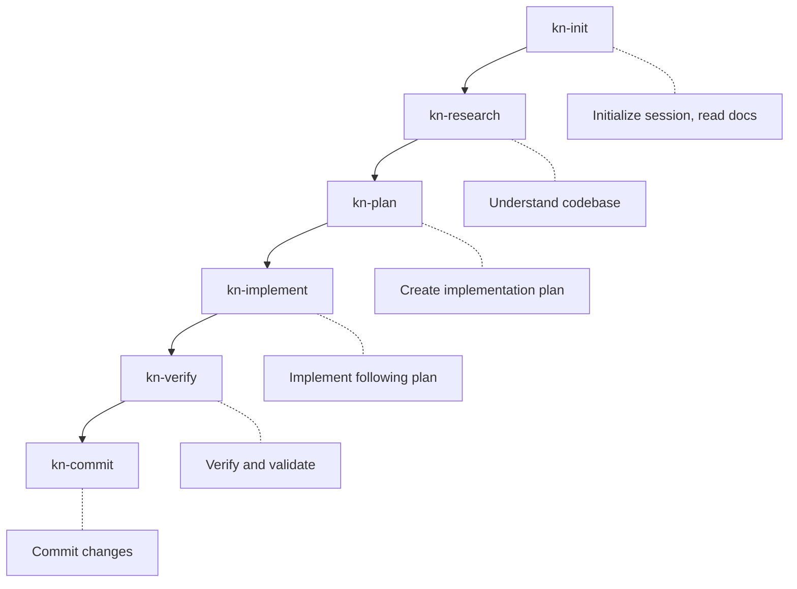
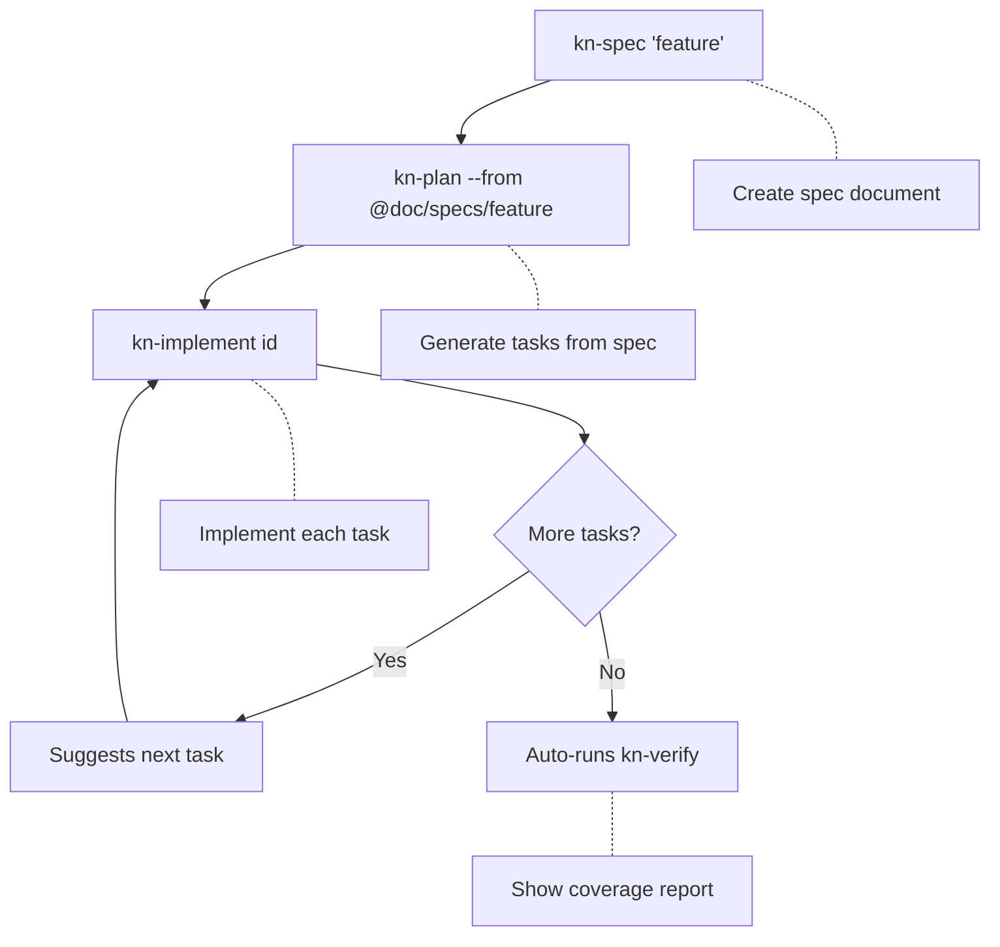

# Skills

Skills are reusable workflows that AI agents can invoke to perform common tasks.

---

## Overview

Skills are markdown files that provide:
- Step-by-step instructions for AI agents
- Context-aware guidance based on project state
- Consistent workflows across different AI platforms

---

## Built-in Skills

Knowns includes 10 built-in skills:

| Skill | Trigger | Purpose |
|-------|---------|---------|
| `kn-init` | `/kn-init` | Initialize session, read project docs |
| `kn-plan` | `/kn-plan` | Create implementation plan for a task |
| `kn-research` | `/kn-research` | Research codebase before implementing |
| `kn-implement` | `/kn-implement` | Implement task following the plan |
| `kn-verify` | `/kn-verify` | Run SDD verification and coverage |
| `kn-spec` | `/kn-spec` | Create specification document |
| `kn-template` | `/kn-template` | Generate code from templates |
| `kn-extract` | `/kn-extract` | Extract reusable patterns to docs |
| `kn-doc` | `/kn-doc` | Work with documentation |
| `kn-commit` | `/kn-commit` | Commit changes with verification |

---

## Skill Structure

Each skill is stored in a folder with `SKILL.md`:

```
.claude/skills/
├── kn-init/
│   └── SKILL.md
├── kn-plan/
│   └── SKILL.md
└── ...
```

### SKILL.md Format

```markdown
---
name: kn-init
description: Initialize session
triggers:
  - /kn-init
  - /kn:init
---

# kn-init: Session Initialization

## When to Use
Use at the start of a new session...

## Steps
1. Detect project
2. Read documentation
3. Check current tasks

## Example
...
```

---

## Using Skills

### Claude Code

Type the trigger in chat:
```
/kn-init
```

Claude Code will load the skill and follow its instructions.

### Antigravity (Gemini CLI)

Same trigger format:
```
/kn-init
```

### Programmatic (MCP)

Skills can also be invoked via MCP by reading the skill content:
```json
// The agent reads the skill and follows instructions
```

---

## Skill Locations

| Platform | Directory |
|----------|-----------|
| Claude Code | `.claude/skills/` |
| Antigravity | `.agent/skills/` |
| Cursor | `.cursor/rules/` |
| Cline | `.clinerules/` |

---

## Syncing Skills

Skills are automatically synced when CLI version changes (see [Auto-Sync](./auto-sync.md)).

Manual sync:
```bash
# Sync all skills
knowns sync skills

# Force overwrite
knowns sync skills --force
```

---

## Instruction Modes

Skills support conditional content based on instruction mode:

| Mode | Description | MCP Tools | CLI Commands |
|------|-------------|-----------|--------------|
| `mcp` | MCP tools focus | ✓ | - |
| `cli` | CLI commands focus | - | ✓ |

Content is rendered using Handlebars:

```markdown
{{#if mcp}}
Use `mcp__knowns__get_task({ "taskId": "42" })`
{{/if}}

{{#if cli}}
Use `knowns task 42 --plain`
{{/if}}
```

---

## Typical Workflow



---

## SDD Workflow (Spec-Driven)

For complex features, use the SDD workflow:



### Auto-Verify Behavior

When completing a task linked to a spec (`kn-implement`):

| Condition | Behavior |
|-----------|----------|
| **More tasks pending** | Suggests next task: `/kn-plan <next-id>` |
| **Last task of spec** | Auto-runs SDD verification + shows coverage report |

This ensures specs are verified automatically when all tasks are complete.

---

## Creating Custom Skills

While built-in skills are auto-synced, you can create custom skills:

1. Create folder in `.claude/skills/`:
   ```
   .claude/skills/my-skill/
   └── SKILL.md
   ```

2. Add frontmatter and content:
   ```markdown
   ---
   name: my-skill
   description: My custom skill
   triggers:
     - /my-skill
   ---

   # My Custom Skill

   ## Steps
   1. Step one
   2. Step two
   ```

3. Use in Claude Code:
   ```
   /my-skill
   ```

**Note:** Custom skills are NOT auto-synced. They will be preserved during auto-sync.

---

## Deprecated Skill Formats

Old formats are automatically cleaned up during sync:

| Old Format | Status |
|------------|--------|
| `knowns.*` | Removed |
| `kn:*` | Removed |

Current format uses hyphen: `kn-init`, `kn-plan`, etc.

---

## Related

- [Auto-Sync](./auto-sync.md) - Automatic skill sync
- [Multi-Platform Support](./multi-platform.md) - Platform-specific locations
- [Templates](./templates.md) - Code generation templates
