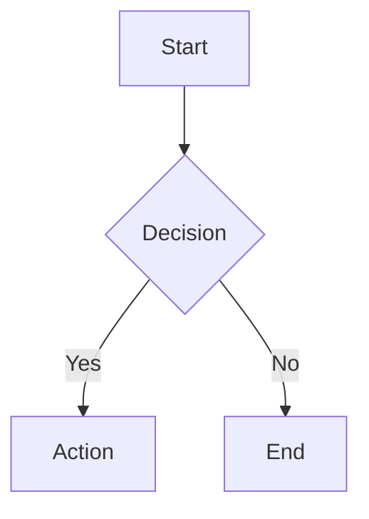
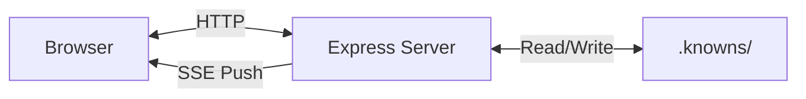

# Web UI Guide

Visual interface for managing tasks and documentation.

## Quick Start

```bash
knowns browser
```

Opens the Web UI at `http://localhost:6420`.

### Options

```bash
knowns browser --port 8080      # Custom port
knowns browser --no-open        # Don't open browser
```

## Features

### Kanban Board

Drag-and-drop task management with columns:

| Column | Status |
|--------|--------|
| To Do | `todo` |
| In Progress | `in-progress` |
| In Review | `in-review` |
| Blocked | `blocked` |
| Done | `done` |

**Actions:**
- Drag tasks between columns to change status
- Click task to view/edit details
- Create new tasks with + button

### Task Details

Click any task to open the detail panel:

- View/edit title and description
- Check/uncheck acceptance criteria
- Update status and priority
- Assign to team members
- View implementation plan and notes
- See time tracking history

### Document Browser

Tree view of all documentation:

```
docs/
├── ai/
│   ├── overview.md
│   └── skills.md
├── architecture/
│   ├── overview.md
│   └── patterns/
├── core/
│   └── time-tracking.md
├── guides/
│   └── user-guide.md
└── templates/
    └── overview.md
```

**Features:**
- Click folder to expand/collapse
- Click document to view content
- Markdown preview with syntax highlighting
- Reference badges (@task, @doc) are clickable

### Global Search

Press `Cmd+K` (Mac) or `Ctrl+K` (Windows) to open search.

Search across:
- Task titles and descriptions
- Document titles and content
- Acceptance criteria

### Mermaid Diagrams

The Web UI renders Mermaid diagrams in markdown preview:

````markdown

````

**Supported diagram types:**
- Flowcharts (`graph`, `flowchart`)
- Sequence diagrams
- Class diagrams
- State diagrams
- Entity relationships
- Gantt charts

Diagrams render automatically when viewing docs or task descriptions. When editing, you see the raw markdown code.

### Dark Mode

Automatically follows system preference. Toggle manually in the UI.

## Keyboard Shortcuts

| Shortcut | Action |
|----------|--------|
| `Cmd/Ctrl + K` | Open search |
| `Escape` | Close modal/panel |

## Real-time Sync

Changes sync in real-time using **Server-Sent Events (SSE)**:

- Multiple browser tabs
- CLI and Web UI
- Team members (same network)

When you run `knowns task edit` in CLI, the Web UI updates instantly.

### Reconnection

SSE automatically reconnects when:
- Network connection is restored
- Computer wakes from sleep
- Server restarts

On reconnection, the UI automatically refreshes data to ensure you see the latest state.

## Reference Badges

Task and doc references render as clickable badges:

| Type | Appearance |
|------|------------|
| `@task-42` | Green badge with task title and status dot |
| `@doc/patterns/auth` | Blue badge with document title |

Click any badge to navigate to that item.

## URL Routing

Direct links to specific views:

| URL | View |
|-----|------|
| `/#/kanban` | Kanban board |
| `/#/kanban/42` | Kanban with task 42 open |
| `/#/docs` | Document browser |
| `/#/docs/patterns/auth.md` | Specific document |

## Architecture



The Web UI connects to a local Express server that reads/writes to your `.knowns/` folder. All data stays on your machine.

Real-time updates use Server-Sent Events (SSE) for efficient one-way push from server to client.

## Troubleshooting

### Port in use

```bash
knowns browser --port 6421
```

### Browser doesn't open

```bash
knowns browser --no-open
# Then manually open http://localhost:6420
```

### Changes not syncing

1. Check if server is running in terminal
2. Refresh the browser
3. Check browser console for SSE connection errors
4. Check the connection indicator in the UI (shows reconnecting status)
