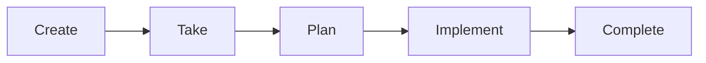
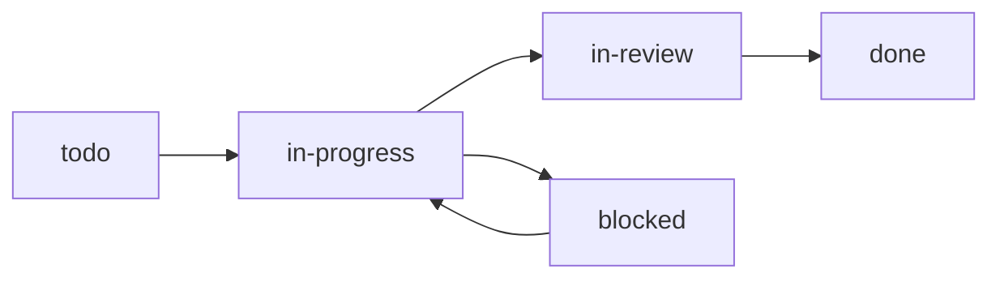

# Task Workflow Guide

Complete guide for managing tasks from creation to completion.

## Overview



### Task Status Flow



## Step 1: Create Task

Create a task with clear acceptance criteria:

```bash
knowns task create "Add user authentication" \
  -d "Implement JWT auth following @doc/architecture/patterns/command" \
  --ac "User can login with email/password" \
  --ac "JWT token is returned on success" \
  --ac "Invalid credentials return 401" \
  --ac "Unit tests cover all scenarios" \
  --priority high \
  -l feature \
  -l auth
```

### Writing Good Acceptance Criteria

**Do:** Write outcome-oriented, testable criteria.

| Bad (Implementation details) | Good (Outcomes) |
|------------------------------|-----------------|
| Add function handleLogin() | User can login and receive JWT |
| Use bcrypt for hashing | Passwords are securely hashed |
| Add try-catch blocks | Errors return appropriate HTTP codes |

## Step 2: Take Task

Assign the task to yourself and set status:

```bash
knowns task edit <id> -s in-progress -a @me
```

## Step 3: Start Timer

Begin tracking time:

```bash
knowns time start <id>
```

## Step 4: Research Context

Before planning, gather context from documentation:

```bash
# Search for related docs
knowns search "authentication" --type doc --plain

# Read relevant documentation
knowns doc "architecture/patterns/command" --plain
knowns doc "guides/user-guide" --plain

# Check similar completed tasks
knowns search "auth" --type task --status done --plain
```

## Step 5: Create Implementation Plan

Add a plan to the task:

```bash
knowns task edit <id> --plan $'1. Review patterns in @doc/architecture/patterns/command
2. Design token structure (access + refresh)
3. Implement login endpoint
4. Implement token refresh endpoint
5. Add middleware for protected routes
6. Write unit tests (aim for 90%+ coverage)
7. Update API documentation'
```

**Important:** Share the plan with your team/AI and wait for approval before coding.

## Step 6: Implement

Work through your plan. Use templates for scaffolding when applicable:

### Using Templates for Code Generation

```bash
# List available templates
knowns template list

# Generate component from template
knowns template run react-component -v name=LoginForm

# Generate API endpoint
knowns template run api-endpoint -v name=auth

# Preview before creating (dry run)
knowns template run react-component -v name=LoginForm --dry-run
```

Templates link to documentation for context:
```bash
# View template details
knowns template view react-component
```

### Tracking Progress

Check criteria as you complete them:

```bash
# Check first criterion
knowns task edit <id> --check-ac 1
knowns task edit <id> --append-notes "Implemented login endpoint"

# Check second criterion
knowns task edit <id> --check-ac 2
knowns task edit <id> --append-notes "JWT token generation working"

# Continue for all criteria...
```

## Step 7: Add Implementation Notes

When complete, add comprehensive notes (useful for PR description):

```bash
knowns task edit <id> --notes $'## Summary
Implemented JWT authentication with access and refresh tokens.

## Changes
- Added POST /auth/login endpoint
- Added POST /auth/refresh endpoint
- Created auth middleware for protected routes
- Added password hashing with bcrypt

## Security
- Access tokens expire in 15 minutes
- Refresh tokens expire in 7 days
- Passwords hashed with bcrypt (12 rounds)

## Tests
- 15 unit tests added
- Coverage: 94%

## Documentation
- Updated API.md with auth endpoints'
```

## Step 8: Validate References

Before completing, validate all references are valid:

```bash
knowns validate
```

This checks for broken `@doc/...` and `@task-...` references in your tasks and docs. Fix any errors before marking done.

## Step 9: Stop Timer and Complete

```bash
knowns time stop
knowns task edit <id> -s done
```

---

## Definition of Done

A task is **Done** only when ALL criteria are met:

### Via CLI

- [ ] All acceptance criteria checked
- [ ] Implementation notes added
- [ ] References validated (`knowns validate`)
- [ ] Timer stopped
- [ ] Status set to done

### Via Code

- [ ] All tests pass
- [ ] Code reviewed
- [ ] Documentation updated
- [ ] No regressions

---

## Working with Subtasks

Create subtasks for complex work:

```bash
# Parent task
knowns task create "Build user dashboard" --priority high

# Subtasks
knowns task create "Design dashboard layout" --parent 42
knowns task create "Implement user stats API" --parent 42
knowns task create "Build dashboard components" --parent 42
knowns task create "Add real-time updates" --parent 42
```

View as tree:

```bash
knowns task list --tree --plain
```

---

## Handling Blocked Tasks

When blocked by external dependencies:

```bash
knowns task edit <id> -s blocked
knowns task edit <id> --append-notes "Blocked: Waiting for API spec from backend team"
```

When unblocked:

```bash
knowns task edit <id> -s in-progress
knowns task edit <id> --append-notes "Unblocked: API spec received"
```

---

## Using Templates

Templates accelerate implementation by generating boilerplate code.

### When to Use Templates

| Scenario | Template |
|----------|----------|
| New component/module | Depends on templates available in your project |
| Repeated scaffolding flow | Prefer a local or imported template |
| Shared team boilerplate | Put it in `.knowns/templates/` or an imported package |

### Template Workflow

```bash
# 1. Find relevant template
knowns template list
knowns template view <name>

# 2. Preview generated files
knowns template run <name> --dry-run

# 3. Generate files
knowns template run <name>

# 5. Customize generated code as needed
```

### Creating Project Templates

If you find yourself creating similar files repeatedly:

```bash
# Create a new template
knowns template create my-template

# Edit the config
# .knowns/templates/my-template/_template.yaml

# Link to documentation (optional)
knowns doc create "patterns/my-pattern" -d "Pattern for my-template"
```

See [templates.md](./templates.md) for full template documentation.

---

## Quick Reference

```bash
# Full workflow
knowns task edit <id> -s in-progress -a @me  # Take
knowns time start <id>                        # Timer
knowns task edit <id> --plan "..."            # Plan
knowns template run <name>                    # Generate code
knowns task edit <id> --check-ac 1            # Check AC
knowns task edit <id> --append-notes "..."    # Progress
knowns validate                               # Validate refs
knowns time stop                              # Stop timer
knowns task edit <id> -s done                 # Complete

# Template commands
knowns template list                          # List templates
knowns template run <name> --dry-run          # Preview
knowns template run <name>                    # Generate
knowns template create <name>                 # Create new
```
