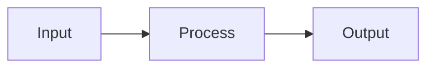

# Planning a Task

**Announce:** "Using kn-plan for task [ID]."

**Core principle:** GATHER CONTEXT → PLAN → VALIDATE → WAIT FOR APPROVAL.

## Inputs

- Task ID, `--new "<work summary>"` for direct task creation, or `--from @doc/<spec-path>` for SDD task generation
- Existing task refs, spec refs, template refs, and user constraints

## Preflight

- Read the task or spec first
- Follow every explicit `@task-`, `@doc/`, and `@template/` ref before finalizing the plan
- Search for adjacent docs/tasks only after reading the primary source
- Do not write a plan that assumes undocumented architecture decisions
- If the user wants an approved spec or multiple linked tasks executed end to end, route to `/kn-flow @doc/<spec-path>` instead of planning one task at a time

## Mode Detection

Check if `$ARGUMENTS` contains `--from`:
- **Yes** → Go to "Generate Tasks from Spec" section. This creates tasks only; use `/kn-flow @doc/<spec-path>` after approval when the goal is execution.
- **No** → Check if `$ARGUMENTS` contains `--new`
  - **Yes** → Go to "Create Task Then Plan" section
  - **No** → Continue with normal planning flow

---

# Create Task Then Plan

Use this mode when the work is too small for a spec or the user has a work summary but no task ID yet.

When `$ARGUMENTS` contains `--new "<work summary>"`:

**Announce:** "Using kn-plan to create and plan a new task."

## Step 0: Create Task

Extract the work summary and classify the lane:
- `tiny` for narrow docs/copy/config/low-risk bug fixes
- `normal` for story-sized work with bounded impact
- `high-risk` only when the summary touches auth, authorization, data migration/loss, external providers, public contracts, security/audit, or broad cross-module behavior

If the work is high-risk, stop and recommend `/kn-spec` unless the user explicitly asked to bypass spec creation.

For tiny/normal work, create the task first:

```json
mcp_knowns_tasks({ "action": "create", "title": "<short task title>",
  "description": "<work summary>",
  "priority": "medium",
  "labels": ["<lane>"]
})
```

If the work needs a short reusable note or convention, create/update the supporting doc or memory before planning and reference it in the task description or plan.

## Step 0.5: Continue With New Task ID

Use the returned `taskId` as `$ARGUMENTS` and continue with Normal Planning Flow.

In the final response, include both:
- the created task ID
- the plan approval status

---

# Normal Planning Flow

## Step 1: Take Ownership

```json
mcp_knowns_tasks({ "action": "get", "taskId": "$ARGUMENTS" })
mcp_knowns_tasks({ "action": "update", "taskId": "$ARGUMENTS",
  "status": "in-progress",
  "assignee": "@me"
})
mcp_knowns_time({ "action": "start", "taskId": "$ARGUMENTS" })
```

## Step 2: Gather Context

Follow refs in task:
```json
mcp_knowns_docs({ "action": "get", "path": "<path>", "smart": true })
mcp_knowns_tasks({ "action": "get", "taskId": "<id>" })
```

If the task links to a spec, use structural resolve to find related tasks and dependencies:
```json
mcp_knowns_search({ "action": "resolve", "ref": "@doc/<spec-path>{implements}", "direction": "inbound", "entityTypes": "task" })
```

Search related (unified search includes docs and memories):
```json
mcp_knowns_search({ "action": "search", "query": "<keywords>", "type": "doc" })
mcp_knowns_search({ "action": "search", "query": "<keywords>", "type": "memory" })
mcp_knowns_templates({ "action": "list" })
```

If relevant memories appear, factor them into the plan (past patterns, decisions, conventions).

If the plan needs assembled execution context rather than raw search hits, use retrieval after discovery:
```json
mcp_knowns_search({ "action": "retrieve", "query": "<keywords>" })
```
If MCP is unavailable, fall back to CLI: `knowns retrieve "<keywords>" --json`

Use `search` for discovery. Use `retrieve` when you need ranked candidates plus a context pack with citations.

## Step 3: Draft Plan

```markdown
## Implementation Plan
1. [Step] (see @doc/relevant-doc)
2. [Step] (use @template/xxx)
3. Add tests
4. Update docs
```

**Tip:** Use mermaid for complex flows:
````markdown

````

Plan quality rules:

- Steps should be outcome-oriented, not a dump of implementation details
- Mention concrete files, docs, or templates when known
- Include testing and validation explicitly
- Keep the plan short enough for approval, but specific enough to execute without re-discovery
- If supporting knowledge is too large, move it into a doc and reference it rather than bloating the plan

## Step 4: Save Plan

```json
mcp_knowns_tasks({ "action": "update", "taskId": "$ARGUMENTS",
  "plan": "1. Step one\n2. Step two\n3. Tests"
})
```

## Step 5: Validate

**CRITICAL:** After saving plan with refs, validate to catch broken refs:

```json
mcp_knowns_validate({ "entity": "$ARGUMENTS" })
```

If errors found (broken `@doc/...` or `@task-...`), fix before asking approval.

## Step 5.5: Pre-Execution Plan Check

Before presenting the plan for approval, verify plan quality:

### AC Coverage
- Every requirement from the task description should map to at least one plan step
- Every plan step should contribute to at least one AC
- Flag any AC that no plan step addresses

### Scope Sizing
- Each plan step should be completable in a single implementation session
- If a step requires reading >10 files or touching >5 files → recommend splitting
- If total plan exceeds ~8 steps → consider splitting into subtasks

### Dependency Check
- Plan steps should be in logical order (foundational first, dependent last)
- Flag circular dependencies between steps
- Flag steps that assume undocumented context

### Risk Assessment
- Steps involving new external dependencies → flag as higher risk
- Steps touching core/shared modules → flag blast radius
- Steps with no test coverage in plan → flag

**Report any issues found inline with the plan:**

```
Plan for task-<id>:
1. Step one
2. Step two
⚠️ Plan check: AC-3 not covered by any step
⚠️ Plan check: Step 4 touches 7 files — consider splitting
```

Fix issues before presenting for approval. If unfixable, surface them explicitly so the user can decide.

## Step 6: Ask Approval

Present plan and **WAIT for explicit approval**.

## Final Response Contract

All built-in skills in scope must end with the same user-facing information order: `kn-init`, `kn-spec`, `kn-flow`, `kn-plan`, `kn-research`, `kn-implement`, `kn-verify`, `kn-doc`, `kn-template`, `kn-extract`, and `kn-commit`.

Required order for the final user-facing response:

1. Goal/result - state what plan or task preview was produced and whether approval is pending.
2. Key details - include the most important supporting context, refs, assumptions, or validation.
3. Next action - recommend a concrete follow-up command only when a natural handoff exists.

Keep this concise for CLI use. Skill-specific content may extend the key-details section, but must not replace or reorder the shared structure.

Out of scope: explaining, syncing, or generating `.claude/skills/*`. Runtime auto-sync already handles platform copies, so this skill source only defines the built-in output contract.

For `kn-plan`, the key details should cover:

- the concise implementation plan
- key assumptions or unresolved questions
- references used to derive the plan
- an explicit approval gate or validation result

---

## CRITICAL: Next Step Suggestion

**You MUST suggest the next action when a natural follow-up exists. User won't know what to do next.**

After user approves the plan:

```
Plan approved! Ready to implement.

Run: /kn-implement $ARGUMENTS
```

If the plan is part of an active `/kn-flow`, return control to that flow so the task can be implemented, reviewed, and verified in schedule order.

**If user wants to review first:**
```
Take your time to review. When ready:

Run: /kn-implement $ARGUMENTS
```

---

## Related Skills

- `/kn-flow @doc/<spec-path>` - Orchestrate an approved spec or task wave after tasks exist
- `/kn-research` - Research before planning
- `/kn-implement <id>` - Implement after plan approved
- `/kn-spec` - Create spec for complex features
- `/kn-plan --new "<work summary>"` - Create a direct task before planning

## Checklist

- [ ] New task created first when using `--new`
- [ ] Ownership taken
- [ ] Timer started
- [ ] Refs followed
- [ ] Templates checked
- [ ] **Validated (no broken refs)**
- [ ] **Pre-execution plan check passed**
- [ ] Routed spec-wide execution to `/kn-flow` when appropriate
- [ ] User approved
- [ ] **Next step suggested**

## Failure Modes

- Missing task/spec -> stop and report the missing ID/path
- `--new` request is high-risk -> recommend `/kn-spec` instead of creating a vague task
- User asks to execute an approved spec -> recommend `/kn-flow @doc/<spec-path>` instead of serial manual planning
- Broken refs -> fix or replace them before asking approval
- Scope too large for one task -> recommend splitting instead of hiding complexity inside one plan

---

# Generate Tasks from Spec

When `$ARGUMENTS` contains `--from @doc/<spec-path>`:

**Announce:** "Using kn-plan to generate tasks from spec [name]."

## Step 1: Read Spec Document

Extract the exact spec path from arguments:
- `--from @doc/specs/2026-06-17/user-auth` → `specs/2026-06-17/user-auth`
- Legacy paths such as `--from @doc/specs/user-auth` are still valid if that spec already exists.

```json
mcp_knowns_docs({ "action": "get", "path": "<spec-path>", "smart": true })
```

Derive a task prefix from the spec path:
- If path is `specs/2026-06-17/user-auth`, use `[user-auth-NN]`.
- If path is legacy `specs/user-auth`, also use `[user-auth-NN]`.
- Keep `NN` zero-padded (`01`, `02`, `03`) so task titles sort correctly.

## Step 2: Parse Requirements

Scan spec for:
- **Functional Requirements** (FR-1, FR-2, etc.)
- **Acceptance Criteria** (AC-1, AC-2, etc.)
- **Scenarios** (for edge cases)

Group related items into logical tasks.

Token control rules:
- Generate tasks in Knowns Tasks, not as a long task list inside the spec body.
- Keep task descriptions concise; put implementation detail in each task plan later.
- The spec should only receive or keep a short `Task Links` section after task creation.

## Step 3: Generate Task Preview

For each requirement/group, create task structure:

```markdown
## Generated Tasks from <spec-path>

### [user-auth-01] [Requirement Title]
- **Description:** [From spec]
- **ACs:**
  - [ ] AC from spec
  - [ ] AC from spec
- **Spec:** <spec-path>
- **Fulfills:** AC-1, AC-2 (maps to Spec ACs this task completes)
- **Priority:** medium
- **Order:** 10

### [user-auth-02] [Requirement Title]
- **Description:** [From spec]
- **ACs:**
  - [ ] AC from spec
- **Spec:** <spec-path>
- **Fulfills:** AC-3
- **Priority:** medium
- **Order:** 20

---
Total: X tasks to create
```

> **CRITICAL:** The `fulfills` field maps Task → Spec ACs. When the task is marked done,
> the matching Spec ACs will be auto-checked in the spec document.

## Step 4: Ask for Approval

> I've generated **X tasks** from the spec. Please review:
> - **Approve** to create all tasks
> - **Edit** to modify before creating
> - **Cancel** to abort

**WAIT for explicit approval.**

## Step 5: Create Tasks

When approved, create tasks with `fulfills` to link Task → Spec ACs:

```json
mcp_knowns_tasks({ "action": "create", "title": "[<slug>-NN] <requirement title>",
  "description": "<from spec>",
  "spec": "<spec-path>",
  "fulfills": ["AC-1", "AC-2"],
  "priority": "medium",
  "labels": ["from-spec", "spec:<slug>", "spec-date:<yyyy-mm-dd>"],
  "order": 10
})
```

Then add implementation ACs (task-level criteria, different from spec ACs):
```json
mcp_knowns_tasks({ "action": "update", "taskId": "<new-id>",
  "addAc": ["Implementation step 1", "Implementation step 2", "Tests added"]
})
```

> **Key Concept:**
> - `fulfills`: Which **Spec ACs** (AC-1, AC-2, etc.) this task satisfies
> - `addAc`: **Implementation ACs** - specific steps to complete the task
>
> When task status → "done", the `fulfills` ACs are auto-checked in the spec document.

Repeat for each task.

Creation rules:

- Group requirements into tasks that can be reviewed and completed independently
- Create task titles with the same compact prefix format: `[<slug>-NN]`.
- Set `order` as `NN * 10` so the board can sort tasks in spec order.
- Add labels `from-spec`, `spec:<slug>`, and `spec-date:<yyyy-mm-dd>` for filtering.
- Keep task ACs implementation-oriented, while `fulfills` stays mapped to spec AC IDs
- Reuse existing tasks if the spec overlaps current in-progress work; do not silently duplicate scope
- If the spec depends on broad domain knowledge, create/update a supporting doc and reference it from the spec or generated tasks
- If the spec reveals general platform work, create a dedicated task and reference it instead of hiding it inside an unrelated feature task
- After creating tasks, update the spec's `Task Links` section with only short links, e.g. `- @task-abc123 [user-auth-01] Add login validation`.

## Step 6: Summary

```markdown
Goal/result: created X tasks linked to `<spec-path>`.

Key details:
- task-xxx: [user-auth-01] Requirement 1 (3 ACs)
- task-yyy: [user-auth-02] Requirement 2 (2 ACs)
- validation/approval status, if relevant

Next action:
- `/kn-flow @doc/<spec-path>` to execute the task set, or `/kn-plan <first-task-id>` for manual task-by-task planning
```

## Checklist (--from mode)

- [ ] Spec document read
- [ ] Requirements parsed
- [ ] **Tasks include `fulfills` mapping to Spec ACs**
- [ ] **Task titles include shared compact prefix**
- [ ] **Task labels and order are set**
- [ ] Tasks previewed
- [ ] User approved
- [ ] Tasks created with spec link and fulfills
- [ ] Spec `Task Links` section updated concisely
- [ ] Next action points to `/kn-flow` for spec-wide execution
- [ ] Summary shown
